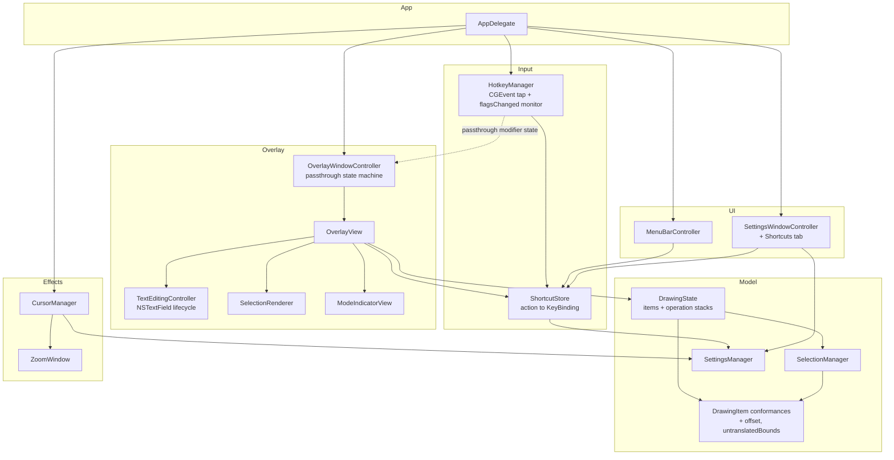
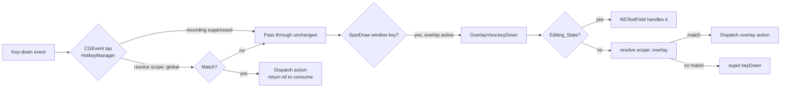
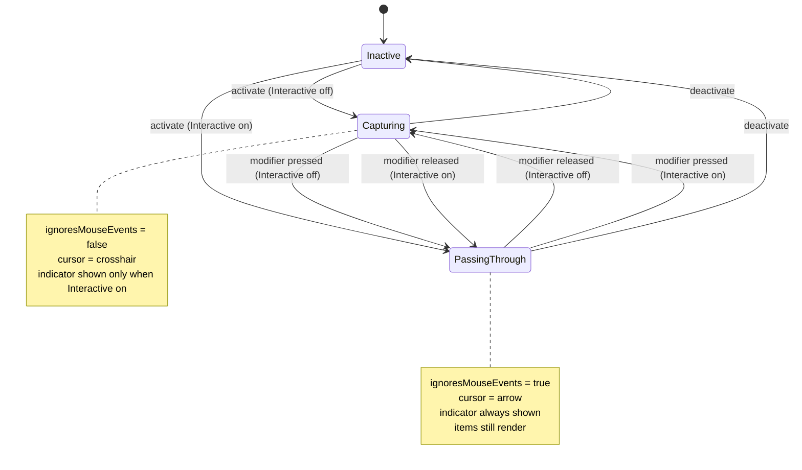

# Design Document

## Overview

This design closes the five capability gaps identified in the requirements: text annotation, select/move/delete, zoom activation, customizable shortcuts, and Fn-key passthrough with Interactive Mode. It also protects the thirteen existing preservation property tests that currently guard drawing, undo/redo, fade, and board-mode behavior.

Two foundational changes unlock everything else, and both are deliberately shaped to minimize the diff against working code:

1. **`DrawingState` moves from two item arrays to an operation stack.** The current model (`items` plus `undoStack: [any DrawingItem]`) can express "an item was added" and nothing else. Move and in-place text edit are not representable. A `DrawingOperation` enum replaces it.
2. **Item translation is expressed as an additive `offset`, not as mutable geometry.** Every existing `draw(in:)` and `hitTest(point:threshold:)` body stays byte-for-byte identical. Translation is applied by a protocol extension.

On top of those, the feature work is largely additive: two new `ToolType` cases, a `TextAnnotation` item, a `SelectionManager` on `DrawingState`, a `ShortcutStore` that displaces the hardcoded `GlobalShortcut` enum, and a passthrough state machine on `OverlayWindowController`.

### Baseline confirmed before design

- `swift build --target SpotdrawTests` succeeds on the current tree.
- `SpotdrawTests/` shares production sources in a **mixed** state, not uniformly by symlink. Five files — `DrawingState.swift`, `DrawingItems.swift`, `OverlayView.swift`, `HotkeyManager.swift`, and `OverlayWindowController.swift` — are symlinks to their counterparts under `Spotdraw/`, so those compile the real production sources. Three files are **real copies**: `AccessibilityManager.swift`, `DrawingRenderer.swift`, and `GeometryUtils.swift`. `SpotdrawTests/AccessibilityManager.swift` has **already drifted** — it is missing the production file's header comment and declares `class AccessibilityManager` where production declares `internal final class AccessibilityManager`, so the test target has been compiling a stale copy since the swift-code-review phase added `final` and `internal`. `DrawingRenderer.swift` and `GeometryUtils.swift` currently `diff` clean, but only incidentally: they are real copies and are one edit away from drifting the same silent way. Separately, **every new production file that tests need must be linked under `SpotdrawTests/`**, or the test target will not compile.
- `project.yml` defines only the `Spotdraw` application target. There is no test target in the Xcode project generation at all, so the SwiftPM and Xcode paths are already divergent.
- The test target is an `executableTarget` with a hand-rolled harness (`SimplePRNG`, `runPreservationTest`), not an XCTest or swift-testing bundle. This constrains the property-testing library choice (see Testing Strategy).

---

## Research Findings

These findings drove the design decisions below. Content was rephrased for compliance with licensing restrictions.

### The Fn modifier flag is unreliable as a "user is holding Fn" signal

A survey of which keys carry `kCGEventFlagMaskSecondaryFn` found that the flag is normally present on Insert/Help, Forward Delete, Home, End, Page Up, Page Down, all arrow keys, and every function key — independent of whether the user touched Fn ([StackOverflow: what keyboard keys require kCGEventFlagMaskSecondaryFn](https://stackoverflow.com/questions/79427662/what-keyboard-keys-require-kcgeventflagmasksecondaryfn-to-be-set)). A separate report confirms `NSEvent.ModifierFlags.function` reads true when pressing F1–F12 with no Fn involvement ([StackOverflow: why is functionKey selected when I press F1, F2](https://stackoverflow.com/questions/57467316/why-is-this-functionkey-selected-when-i-press-f1-f2-etc)). Treating the flag as intent produces false positives on ordinary navigation keys.

### Fn is the Globe key and macOS owns its single-press behavior

On current macOS, Keyboard settings expose a "Press 🌐/fn key to" control whose options are Change Input Source, Show Emoji & Symbols, Start Dictation, and Do Nothing ([Apple: Change Keyboard settings on Mac](https://support.apple.com/guide/mac-help/change-keyboard-settings-kbdm162/mac/)). The key's meaning is a user-configurable system binding, so an application cannot assume a press is available to it.

### `flagsChanged(with:)` on `OverlayView` is structurally the wrong observer

`NSView.flagsChanged(with:)` only fires while a SpotDraw window is key. Passthrough exists precisely so that another application is key and receiving input. The observer must therefore be a process-wide monitor, not a view method.

### The leading open-source competitor uses a toggle, not a held modifier

epilande/Annotate advertises an "Always-On Mode" that displays annotations persistently without user interaction ([Annotate README](https://github.com/epilande/Annotate/blob/main/README.md)). That a keyboard-driven competitor chose a mode toggle over a held modifier is corroborating evidence that the held-modifier path is the fragile one.

### Control+Z is reserved by every shell on the machine

In any POSIX shell, Control+Z sends `SIGTSTP` to suspend the foreground job. The `HotkeyManager` CGEvent tap is created at `.cgSessionEventTap` with `.headInsertEventTap` and returns `nil` on a match, which **consumes the event session-wide**. A Control+Z global binding would silently break job control in every terminal on the machine.

---

## Key Design Decisions

### Decision 1 — Undo model: operation stack replaces the two-array model

`DrawingState` currently holds `items: [any DrawingItem]` and `private var undoStack: [any DrawingItem]`. There is no redo stack; `redo()` pops from `undoStack`, which conflates "undone items" with "undo history". This cannot represent a move (no item is added or removed) or an in-place text edit (an item is replaced).

**Decision:** introduce a reversible operation type and two stacks of operations.

```swift
/// A reversible change to the drawing model.
internal enum DrawingOperation {
    /// An item was appended to the end of the item list.
    case add(item: any DrawingItem)
    /// Items were removed, paired with the indices they occupied before removal.
    case remove(entries: [(index: Int, item: any DrawingItem)])
    /// Items were translated by an offset.
    case move(itemIDs: [UUID], offset: CGSize)
    /// An item was replaced in place, preserving its index.
    case edit(index: Int, before: any DrawingItem, after: any DrawingItem)
}
```

`DrawingState` gains `private var undoStack: [DrawingOperation]` and `private var redoStack: [DrawingOperation]`.

Inverses:

| Operation | Undo | Redo |
| --- | --- | --- |
| `.add(item)` | remove the last item | append `item` |
| `.remove(entries)` | reinsert at recorded indices in **ascending** index order | remove those items again |
| `.move(ids, offset)` | translate each item by the negated offset | translate by the offset |
| `.edit(index, before, after)` | replace element at `index` with `before` | replace with `after` |

Ascending reinsertion order is required for correctness: inserting `[(0, a), (2, c)]` descending would place `c` at index 2 of a list that does not yet contain `a`, shifting it wrong.

`addItem(_:)` keeps its current semantics exactly — append, then clear the redo stack.

**Migration risk — call this out loudly.** `SpotdrawTests/PreservationPropertyTests.swift` contains 13 property tests, 5 of which exercise undo/redo directly: `testUndoRedoPreservation`, `testMultipleUndoRedoPreservation`, `testUndoOnEmptyIsNoop`, `testRedoOnEmptyIsNoop`, `testAddAfterUndoClearsRedoStack`, plus `testClearAllPreservation` which asserts that redo after `clearAll()` is a no-op. These tests observe behavior only through `state.items.count`. The following observable behaviors **must** be preserved by the rewrite:

1. Undo after N adds leaves N−1 items; redo restores N.
2. K undos then K redos returns to the original count.
3. Undo on an empty state is a no-op.
4. Redo with nothing undone is a no-op.
5. Adding an item after an undo makes a subsequent redo a no-op.
6. `clearAll()` empties items and makes redo a no-op.

Point 6 deserves attention: `clearAll()` must clear **both** stacks, not record a `.remove` operation. If it recorded `.remove`, redo would still be a no-op (redo stack is cleared) but undo would resurrect every item — a behavior change not covered by the existing tests and not requested by Requirement 10.8, which explicitly says clear-all clears the undo stack. **Verification step:** run the preservation suite immediately after the `DrawingState` rewrite and before any feature work, and confirm 13/13 still pass.

### Decision 2 — Move geometry: caller-applied translation offset, not mutable geometry

Every conformance in `DrawingItems.swift` stores immutable geometry: `let points`, `let rect`, `let start`, `let end`. Making them mutable would require rewriting all five `draw(in:)` bodies and all five `hitTest` bodies, each of which is currently exercised by tests.

**Decision:** add two protocol members and apply translation in a protocol extension.

```swift
internal protocol DrawingItem: AnyObject {
    // ... existing members unchanged ...

    /// Accumulated translation applied at render and hit-test time.
    var offset: CGSize { get set }

    /// The smallest rectangle containing this item's rendered geometry, before `offset`.
    var untranslatedBounds: CGRect { get }
}
```

Each of the six conforming classes gains exactly one stored line — `var offset: CGSize = .zero` — plus a computed `untranslatedBounds`. Their existing `draw(in:)` and `hitTest(point:threshold:)` bodies are **completely untouched**.

```swift
extension DrawingItem {
    /// Bounding rectangle in view coordinates, including `offset`.
    var bounds: CGRect {
        untranslatedBounds.offsetBy(dx: offset.width, dy: offset.height)
    }

    /// Renders with `offset` applied via a context transform.
    func render(in context: CGContext) {
        guard offset != .zero else {
            draw(in: context)
            return
        }
        context.saveGState()
        context.translateBy(x: offset.width, y: offset.height)
        draw(in: context)
        context.restoreGState()
    }

    /// Hit-tests in view coordinates by moving the test point into untranslated space.
    func hitTestTranslated(point: CGPoint, threshold: CGFloat) -> Bool {
        let local = CGPoint(x: point.x - offset.width, y: point.y - offset.height)
        return hitTest(point: local, threshold: threshold)
    }

    /// Accumulates a translation.
    func translate(by delta: CGSize) {
        offset = CGSize(width: offset.width + delta.width, height: offset.height + delta.height)
    }
}
```

Exactly two call sites change:

- `OverlayView.draw(_:)`: `item.draw(in: context)` becomes `item.render(in: context)`.
- `DrawingState.removeItems(intersecting:threshold:)`: `hitTest` becomes `hitTestTranslated`.

**Tradeoff.** The original geometry survives as provenance, which is directly useful for a later SVG/PDF export feature and makes a move losslessly reversible by construction. The cost is one `saveGState`/`translateBy`/`restoreGState` triple per translated item per frame. Untranslated items — the overwhelming majority — take the fast path and pay nothing. The alternative (rewriting geometry in place) would be faster by an immeasurable margin and would put six tested render paths at risk; that trade is not worth taking.

**`untranslatedBounds` per type:**

| Type | Bounds |
| --- | --- |
| `FreehandStroke` | bounding box of `points`, outset by `lineWidth / 2` |
| `ArrowShape` | box spanning `start` and `end`, outset by `lineWidth * 2` (arrowhead reaches `lineWidth * 4` back along the shaft but not beyond `end` laterally by more than that) |
| `LineShape` | box spanning `start` and `end`, outset by `lineWidth / 2` |
| `RectangleShape` | `rect` outset by `lineWidth / 2` |
| `CircleShape` | `rect` outset by `lineWidth / 2` |
| `TextAnnotation` | measured glyph bounds from `NSAttributedString.size()`, anchored at `anchor` |

`FreehandStroke` should cache its bounds — it is computed from a point array that can hold hundreds of entries, and `bounds` is read on every marquee test and every selection-outline draw. Since `points` is `let`, a `lazy var` is safe.

### Decision 3 — Passthrough: configurable modifier defaulting to Right Option, with a toggle mode as the primary path

The research above rules out a naive Fn implementation: the flag is spuriously set on navigation and function keys, macOS owns the key's press semantics, and `OverlayView.flagsChanged` cannot fire while another app is key. The design therefore provides two mechanisms and makes the toggle primary.

**A. Passthrough via held modifier (secondary, configurable).**

- Observed through a dedicated `NSEvent.addGlobalMonitorForEvents(matching: .flagsChanged)` monitor **owned by `HotkeyManager`**, not by `OverlayView`. A global monitor fires regardless of which application is key, which is the only arrangement that works in passthrough.
- The modifier is user-selectable: **Right Option (default)**, Right Command, Fn, or Off.
- Right Option is the default because it is not spuriously set on other keys, is not reserved by the system, and is not used for chording by most applications. Left/right discrimination uses the device-dependent bits in the modifier flags raw value (`0x40` for right Option, `0x10` for right Command), which `flagsChanged` events carry.
- Selecting Fn surfaces an advisory in the settings UI: macOS may intercept the key, and some keyboards report it inconsistently.

**B. Always-On / Interactive Mode (primary, toggle-based).** Satisfies Requirement 9. Toggled by hotkey or menu item; persisted. The overlay renders but never captures mouse input until toggled back, with the held modifier providing the temporary inverse.

**Requirement traceability note.** Requirement 8's criteria are written against "the Fn_Modifier". The implementation generalizes this to "the configured passthrough modifier". Fn remains one selectable option, so every Requirement 8 criterion is satisfiable as written by selecting Fn; the default simply differs. This is a deliberate, documented widening of the requirement, not a deviation from it.

### Decision 4 — Zoom default binding: Control+M, not Control+Z

`GlobalShortcut.toggleZoom` currently declares Control+Z (`keyCode: 6`, `.control`). Reject it: the CGEvent tap consumes matched events **session-wide**, and Control+Z is `SIGTSTP` in every shell. Swallowing it would break job control across the whole machine — a severe and near-impossible-to-diagnose side effect for the user. Note that there is no *internal* collision, since SpotDraw's own undo is Command+Z; the problem is purely the global consumption of a key the OS and shells depend on.

Defaults chosen:

| Action | Binding | Key code |
| --- | --- | --- |
| Toggle zoom | Control+M ("magnify") | 46 |
| Zoom in | Control+= | 24 |
| Zoom out | Control+- | 27 |

Control+= / Control+- mirror the size-adjustment convention users already expect from cursor-effect tools. All three are rebindable through the new `ShortcutStore`, so a user who genuinely wants Control+Z can choose it deliberately and own the consequence.

### Decision 5 — Test source sharing and property-testing library: fix drift now, defer the target split

The evidence that matters here is the drift already recorded in the baseline: `SpotdrawTests/AccessibilityManager.swift` is a real copy that lost the production file's `internal final` declaration and header comment, and the test target has been compiling that stale copy silently. `DrawingRenderer.swift` and `GeometryUtils.swift` are the same kind of copy and happen to be identical today. The demonstrated harm in this repository is source divergence, not the absence of a shrinking property-testing library.

**Decision:** fix the drift in Phase 1 with an idempotent symlink script, and defer the `SpotdrawCore` extraction, the `SpotdrawPropertyTests` target, and the PropertyBased dependency to a standalone change after Phase 1 lands. The 13 preservation tests stay exactly as they are — they are the regression guard and must remain runnable and unmodified.

```bash
# scripts/link-test-sources.sh — run after adding any production file
for f in $(find Spotdraw -name '*.swift' -not -path '*/App/*'); do
  ln -sf "../$f" "SpotdrawTests/$(basename $f)"
done
```

The script must **replace** the three real copies rather than sit alongside them. `AccessibilityManager.swift` regaining its production content is itself a behavior-affecting change to what the test target compiles, so the preservation suite must be re-run against it.

Rationale for staging it this way:

1. The demonstrated harm is drift, not the missing library. Drift has already occurred once, silently, and nothing currently prevents the next occurrence.
2. The headline risk in Phase 1 is the `DrawingState` undo rewrite (Decision 1). The guard against it is the existing 13 preservation tests, which already run today and need no new library to do so.
3. The extraction carries genuine unresolved uncertainty. The natural target shape nests paths — `SpotdrawCore` at `path: "Spotdraw"` with `exclude: ["App"]`, the executable at `path: "Spotdraw/App"` — and whether SwiftPM accepts nested target paths or demands a `Sources/` reshuffle is unverified. A reshuffle would break `project.yml`'s `path: Spotdraw`. Resolving that mid-feature is the wrong time.
4. Shrinking is ergonomics, not correctness. The existing harness already seeds deterministically per iteration, so counterexamples are reproducible — which is the property that actually matters when debugging a failure.
5. The cost of deferring is bounded: Properties 1–5 get written against the hand-rolled harness and later ported. Roughly an hour, and cheap relative to debugging the build system and the undo rewrite at the same time.

The library research stands as forward-looking guidance for the deferred change. [PropertyBased](https://github.com/x-sheep/swift-property-based), pinned `from: "1.0.0"`, remains the intended library: it provides QuickCheck-style generation and shrinking on top of swift-testing. SwiftCheck stays rejected — no release since 2021 and XCTest-bound. The local toolchain is Swift 6.3.2, comfortably above PropertyBased's Swift 6.2 floor.

Consequences for the property work: **Properties 1–5 land on the existing hand-rolled harness** in `SpotdrawTests`, since they gate Phase 1's first step and cannot wait. **Properties 6–26 land after the split.** The deferred change must answer the SwiftPM nested-target-path question before anything else, because the answer determines whether the split is a `Package.swift` edit or a directory reshuffle that also rewrites `project.yml`.

---

## Architecture

### Component relationships



### Shortcut dispatch scopes

Two dispatch paths, deliberately kept disjoint so that a tool key like `p` cannot be swallowed system-wide:



Global actions require at least one modifier (enforced at recording time, Requirement 7.11) so they never collide with plain typing. Overlay actions may be unmodified single characters, preserving today's `p`/`a`/`r`/`o`/`l`/`h`/`e` and `1`–`5` bindings.

### Passthrough state machine

`OverlayWindowController` owns a single derived predicate. Both inputs are observed process-wide, so the state is correct regardless of which application is key.

```
capturesMouse = overlayActive && (interactiveModeEnabled ? modifierHeld : !modifierHeld)
```



On entry to `PassingThrough`, the controller must first drain in-flight interaction: commit any in-progress drawing gesture at the current cursor point (Requirement 8.4) and commit any open text edit (Requirement 8.5). Deactivation while the modifier is held sets every window to ignore mouse events and removes the indicator (Requirement 8.10). Window rebuild after a screen-parameter change re-applies the current state to each new window (Requirement 8.12) — today `rebuildWindows()` calls `activate()`, which unconditionally sets `ignoresMouseEvents = false`; that becomes a call to the derived-state applier.

---

## Components and Interfaces

### `DrawingOperation` and the reshaped `DrawingState`

```swift
internal final class DrawingState {
    var items: [any DrawingItem] = []
    private var undoStack: [DrawingOperation] = []
    private var redoStack: [DrawingOperation] = []

    let selection = SelectionManager()

    var activeTool: ToolType = .pen {
        didSet {
            // Requirement 2.12
            if activeTool != .select { selection.clear() }
        }
    }
    var activeColor: NSColor = .systemRed
    var activeLineWidth: CGFloat = 3.0
    var boardMode: BoardMode = .none
    var fadeMode: Bool = false
    var fadeDuration: TimeInterval = 3.0

    // Unchanged observable semantics
    func addItem(_ item: any DrawingItem)
    func undo()
    func redo()
    func clearAll()
    func removeItem(at index: Int)
    func removeItems(intersecting point: CGPoint, threshold: CGFloat = 10)

    // New
    func removeSelected()                                   // Requirement 3.7
    func translate(ids: [UUID], by offset: CGSize)           // records .move, Requirement 3.4
    func replaceItem(at index: Int, with item: any DrawingItem)  // records .edit, Requirement 1.9
    func item(withID id: UUID) -> (any DrawingItem)?
    func selectAll()                                        // Requirement 2.10
}
```

Every mutation that removes an item routes through a single private helper that also prunes the selection, so Requirement 2.14 holds by construction rather than by discipline at each call site.

### `SelectionManager`

**Placement decision: `SelectionManager` is owned by `DrawingState`, not by `OverlayView`.**

`DrawingState` is already the shared reference type across every per-screen `OverlayView` (`OverlayWindowController.makeOverlayWindow` assigns the same instance to each view). Selection must be shared for the same reason the item list is: a marquee drag on one display and a delete keystroke while another display's window is key must refer to the same selection. Putting it on the view would give each display its own selection, and the delete action — dispatched from whichever view is first responder — would act on the wrong set. The cost is that `SelectionManager` inherits the pre-existing coordinate-space caveat described below.

```swift
@MainActor internal final class SelectionManager {
    private(set) var selectedIDs: Set<UUID> = []

    var isEmpty: Bool { selectedIDs.isEmpty }
    func contains(_ id: UUID) -> Bool
    func set(_ ids: Set<UUID>)
    func toggle(_ id: UUID)          // Requirements 2.8, 2.9
    func insert(_ id: UUID)
    func remove(_ id: UUID)          // Requirement 2.14
    func clear()                     // Requirements 2.5, 2.12, 2.13, 10.8

    /// Union of the `bounds` of every selected item. Nil when the selection is empty.
    func boundingBox(in items: [any DrawingItem]) -> CGRect?

    /// Items whose `bounds` intersect the marquee. Requirement 2.7
    static func itemsIntersecting(_ marquee: CGRect, in items: [any DrawingItem]) -> Set<UUID>

    /// Topmost item whose translated hit-test matches. Requirement 2.4
    static func topmostHit(at point: CGPoint, threshold: CGFloat, in items: [any DrawingItem]) -> (any DrawingItem)?
}
```

`topmostHit` iterates `items` in reverse, since later items render on top.

### `TextAnnotation`

```swift
internal final class TextAnnotation: DrawingItem {
    let id = UUID()
    private(set) var string: String
    private(set) var anchor: CGPoint      // lower-left of the text box, view coordinates
    let fontSize: CGFloat
    let color: NSColor
    let createdAt = Date()
    var opacity: CGFloat = 1.0
    var offset: CGSize = .zero

    init(string: String, anchor: CGPoint, fontSize: CGFloat, color: NSColor)

    /// Rendered via NSAttributedString into the current graphics context.
    func draw(in context: CGContext)

    /// True when `point` lies within the measured glyph bounds. Requirement 1.11
    func hitTest(point: CGPoint, threshold: CGFloat) -> Bool

    /// Measured glyph bounds anchored at `anchor`. Requirement 1.12
    var untranslatedBounds: CGRect

    /// Returns a copy with a new string, preserving id, anchor, fontSize, and color.
    func replacingString(_ newString: String) -> TextAnnotation
}
```

Rendering pushes an `NSGraphicsContext` wrapping the `CGContext`, then calls `NSAttributedString.draw(at:)`. Attributes are `.font` (system font at `fontSize`), `.foregroundColor` (`color`), and the item's `opacity` applied through `context.setAlpha` so fade processing works unchanged (Requirement 10.5). `untranslatedBounds` derives from `NSAttributedString.size()` and is cached, since the string is only replaced through `replacingString`.

`replacingString` returning a copy rather than mutating is what makes `.edit(index:before:after:)` trivially invertible — undo just puts `before` back.

### `TextEditingController`

**Decision: editing uses a real `NSTextField` subview, not hand-rolled key handling.**

Adding an `NSTextField` to `OverlayView` for the duration of Editing_State inherits, for free, everything that hand-rolled `keyDown` accumulation would have to reimplement: input-method support for non-Latin scripts (a hand-rolled path would make SpotDraw unusable for CJK input), text selection, caret placement and blinking, arrow-key navigation, click-to-position, and the system Edit menu. The tradeoff is that the field is a real first responder, so `OverlayView.keyDown` stops receiving keystrokes while editing — which is exactly why Escape handling must be context-aware (below), and why the field is configured borderless and transparent so it visually matches the committed `TextAnnotation` it will become.

```swift
@MainActor internal final class TextEditingController: NSObject, NSTextFieldDelegate {
    private(set) var isEditing: Bool

    /// The item being edited, or nil when composing a new annotation.
    private(set) var editingItem: TextAnnotation?

    /// Begins editing. `existing` nil means compose new at `anchor`.
    func begin(at anchor: CGPoint, existing: TextAnnotation?, in view: OverlayView,
               color: NSColor, fontSize: CGFloat)

    /// Commits and tears down the field. Returns the resulting action.
    func commit() -> TextCommitResult

    enum TextCommitResult {
        case discarded                                  // Requirement 1.7
        case created(TextAnnotation)                    // Requirement 1.5
        case edited(original: TextAnnotation, updated: TextAnnotation)  // Requirement 1.9
    }
}
```

The color and font size are captured at `begin` time and carried through to the committed item, satisfying Requirement 1.15 even if the user changes the active color mid-composition.

Both Return and Escape commit (Requirements 1.5, 1.6) — Escape does **not** cancel, and does not deactivate the overlay. `commit()` trims the string and returns `.discarded` when the result is empty, leaving `DrawingState.items` untouched (Requirement 1.7).

### Context-aware Escape and key routing in `OverlayView`

`OverlayView.keyDown` currently checks `hasControl && characters == "d"` before its switch, and handles `\u{1B}` as deactivate. Both become `ShortcutStore` lookups, and Editing_State must be checked first:

```swift
override func keyDown(with event: NSEvent) {
    // While editing, the NSTextField is first responder and receives keys directly.
    // This guard covers the case where focus has not yet transferred.
    if textEditing.isEditing {
        if event.keyCode == kVK_Escape || event.keyCode == kVK_Return {
            finishTextEditing()
            return
        }
        super.keyDown(with: event)
        return
    }

    let mods = event.modifierFlags.intersection(.deviceIndependentFlagsMask)
    guard let action = ShortcutStore.shared.resolve(keyCode: event.keyCode,
                                                   modifiers: mods,
                                                   scope: .overlay) else {
        super.keyDown(with: event)
        return
    }
    perform(action)
}
```

Requirement 10.12 — deactivate only fires outside Editing_State — is satisfied by the ordering of that guard.

### `ShortcutStore`

```swift
internal enum ShortcutScope { case global, overlay }

internal enum ShortcutCategory: String, CaseIterable {
    case global = "Global"
    case tools = "Annotation Tools"
    case colors = "Colors"
    case actions = "Actions"
}

/// A key code paired with a set of modifier flags.
internal struct KeyBinding: Codable, Hashable, Sendable {
    let keyCode: UInt16
    /// Raw value of the device-independent NSEvent.ModifierFlags subset.
    let modifierRawValue: UInt

    var modifiers: NSEvent.ModifierFlags { .init(rawValue: modifierRawValue) }
    var cgEventFlags: CGEventFlags { /* mapped */ }
    /// Human-readable rendering, e.g. "⌃⇧S". Requirement 7.3
    var displayString: String { /* ... */ }
}

internal enum ShortcutAction: String, CaseIterable {
    // Global — Requirement 6.1
    case toggleAnnotation, toggleCursorHighlight, toggleSpotlight, toggleZoom
    case cycleCursorSize, zoomIn, zoomOut, toggleInteractiveMode
    // Tools — Requirement 6.2
    case toolPen, toolArrow, toolRectangle, toolCircle, toolLine
    case toolHighlighter, toolEraser, toolText, toolSelect
    // Colors — Requirement 6.3
    case colorRed, colorBlue, colorGreen, colorYellow, colorWhite
    // Overlay actions — Requirement 6.4
    case undo, redo, clearAll, cycleBoardMode, toggleFadeMode
    case deleteSelection, selectAll, deactivateOverlay

    var scope: ShortcutScope { self.category == .global ? .global : .overlay }
    var category: ShortcutCategory { /* ... */ }
    var displayName: String { /* ... */ }
    var defaultBinding: KeyBinding { /* table below */ }
}
```

The `String` raw value is the persistence key, so adding cases later cannot invalidate stored bindings the way ordinal indices would.

**Cleared marker.** "No binding stored, fall back to default" and "explicitly cleared by the user" are different states and must be distinguishable (Requirements 6.7, 6.13, 7.4). An explicit sentinel record carries the distinction:

```swift
private struct StoredBinding: Codable {
    /// True when the user explicitly cleared this action.
    var cleared: Bool
    /// The assigned binding. Nil when `cleared` is true.
    var binding: KeyBinding?
}
```

Persistence is a single `UserDefaults` key holding JSON-encoded `[String: StoredBinding]`, written through `SettingsManager`. An action absent from the dictionary resolves to its default.

```swift
@MainActor internal final class ShortcutStore {
    static let shared = ShortcutStore()

    /// Assigned binding, or nil when cleared. Requirements 6.7, 6.13
    func binding(for action: ShortcutAction) -> KeyBinding?

    /// Reverse lookup within a dispatch scope. Requirements 6.9, 6.10
    func resolve(keyCode: UInt16, modifiers: NSEvent.ModifierFlags,
                 scope: ShortcutScope) -> ShortcutAction?

    /// The action already holding this binding in the same scope, if any. Requirement 7.8
    func conflictingAction(for binding: KeyBinding,
                           excluding action: ShortcutAction) -> ShortcutAction?

    func assign(_ binding: KeyBinding, to action: ShortcutAction)   // Requirement 7.7
    func clear(_ action: ShortcutAction)                            // Requirement 7.12
    func reset(_ action: ShortcutAction)                            // Requirement 7.13
    func resetAll()                                                 // Requirement 7.14

    /// Posted on every mutation. Requirements 6.11, 7.15
    static let didChangeNotification = Notification.Name("ShortcutStoreDidChange")
}
```

`resolve` reads from a `[ShortcutScope: [KeyBinding: ShortcutAction]]` reverse index rebuilt on each mutation. Uniqueness within a scope is an invariant maintained by `assign` (which clears the conflicting action when the user confirms, Requirement 7.9), so lookup is unambiguous. Duplicate bindings **across** scopes are permitted — Requirement 4.2 scopes the uniqueness constraint to a single dispatch scope, which is what lets overlay tool keys stay unmodified single characters.

Note that the requirements document's Open Question 1 attributes the uniqueness constraint to Requirement 6.2; the constraint is actually stated in Requirement 4.2. Requirement 6.2 concerns per-tool action coverage. The design follows 4.2.

Neither `HotkeyManager` nor `OverlayView` caches bindings; both call `resolve` per event. Requirement 6.11 (no restart needed) therefore holds without any invalidation logic.

**Default bindings** (Requirement 6.14 preserves current behavior; new actions filled in per Decision 4):

| Action | Default | Scope |
| --- | --- | --- |
| Toggle annotation | Control+D | global |
| Toggle cursor highlight | Control+S | global |
| Toggle spotlight | Control+L | global |
| Cycle cursor size | Control+Shift+S | global |
| Toggle zoom | Control+M | global |
| Zoom in / out | Control+= / Control+- | global |
| Toggle Interactive Mode | Control+Shift+I | global |
| Pen / Arrow / Rectangle / Circle / Line / Highlighter / Eraser | `p` / `a` / `r` / `o` / `l` / `h` / `e` | overlay |
| Text / Select | `t` / `s` | overlay |
| Colors 1–5 | `1` … `5` | overlay |
| Undo / Redo | Command+Z / Command+Shift+Z | overlay |
| Cycle board mode | `b` | overlay |
| Toggle fade mode | Space | overlay |
| Select all | Command+A | overlay |
| Delete selection | Delete | overlay |
| Deactivate overlay | Escape | overlay |
| Clear all | Command+Delete | overlay |

`t` and `s` are free — no existing `ToolType.keyCharacter` uses them, and Control+S is a *global* binding in a different scope.

### `HotkeyManager` changes

Three changes, no structural rewrite. `GlobalShortcut` is deleted.

1. **Resolution through the store.** The static tap callback replaces its `handlers` dictionary walk with `ShortcutStore.shared.resolve(..., scope: .global)`, dispatching via a `[ShortcutAction: () -> Void]` handler map and returning `nil` to consume on a match (Requirements 6.9, 6.15). The existing `.tapDisabledByTimeout` / `.tapDisabledByUserInput` re-enable path is preserved verbatim.

2. **Recording suppression.** A `nonisolated(unsafe)` flag readable from the C callback:

```swift
/// While true, the tap consumes nothing so the Shortcuts tab can capture
/// the raw combination. Requirement 7.16
var isRecordingSuppressed: Bool
```

The callback checks it immediately after the tap-disabled handling and returns the event unchanged when set. The Shortcuts tab sets it on entering Recording_State and clears it on exit — including on the Escape and conflict paths, so a cancelled recording cannot leave global shortcuts dead.

3. **Passthrough modifier monitoring.** A global `.flagsChanged` monitor, installed only while the overlay is active:

```swift
/// Invoked when the configured passthrough modifier transitions. Decision 3
var onPassthroughModifierChange: ((Bool) -> Void)?
```

Detection reads the device-dependent bits of `event.modifierFlags.rawValue`:

| Modifier | Mask |
| --- | --- |
| Right Option | `0x40` |
| Right Command | `0x10` |
| Fn | `NSEvent.ModifierFlags.function` |

The monitor is torn down when the overlay deactivates, so an inactive overlay costs nothing.

The existing local `NSEvent` monitor is **removed**. It currently double-dispatches: a Control+D pressed while a SpotDraw window is key is handled by both the tap and the local monitor, and today only survives because toggling twice in the same runloop turn happens not to be observable. With the store in place, keeping both paths would make every global shortcut fire twice while the overlay is key. The tap covers the key-window case already.

### `OverlayWindowController` changes

```swift
@MainActor internal final class OverlayWindowController {
    private(set) var isActive = false
    private(set) var isPassthrough = false
    private var modifierHeld = false

    var interactiveModeEnabled: Bool { didSet { applyMouseAcceptance() } }  // Requirement 9.7

    /// Called by AppDelegate from HotkeyManager's flagsChanged monitor.
    func setPassthroughModifierHeld(_ held: Bool)

    /// Single point that derives and applies ignoresMouseEvents, cursor,
    /// and Mode_Indicator visibility from (isActive, interactiveModeEnabled, modifierHeld).
    private func applyMouseAcceptance()
}
```

`applyMouseAcceptance()` is the only writer of `ignoresMouseEvents` and cursor state, called from `activate()`, `deactivate()`, `setPassthroughModifierHeld(_:)`, the `interactiveModeEnabled` setter, and `rebuildWindows()`. Centralizing it is what makes Requirements 8.12 and 9.7 fall out for free instead of needing per-path handling.

Before entering passthrough it calls into each `OverlayView` to drain in-flight interaction (Requirements 8.4, 8.5).

### `CursorManager` and `ZoomWindow` changes

```swift
// New on CursorManager
func toggleZoom()                  // exists, now actually reachable — Requirement 4.1
func zoomIn()                      // Requirements 5.4, 5.6
func zoomOut()                     // Requirements 5.5, 5.7
func updateZoomAppearance()        // Requirement 5.9
```

`activateZoom()` gains a screen-recording permission gate using `CGPreflightScreenCaptureAccess()`, presenting the alert and leaving `isZoomActive` false when absent (Requirement 4.7). It also applies persisted zoom level and bubble size before `show()` (Requirement 5.3).

`ZoomWindow.zoomLevel` and `bubbleSize` already clamp in their `didSet` and `bubbleSize` already calls `resizeWindow()`, which updates the window size, mask path, and border path — Requirement 5.10 is satisfied by existing code. `zoomIn`/`zoomOut` step by 0.5 and persist; clamping to 2.0…4.0 is already enforced by the property observer, so 5.6 and 5.7 need no new logic.

Zoom is independent of the annotation overlay — no cross-wiring — which satisfies Requirement 4.10 by construction. `applicationWillTerminate` gains a `cursorManager.shutdown()` call that stops the capture timer and releases the window (Requirement 4.11).

### `MenuBarController` changes

- Zoom toggle item, with state tracking (Requirements 4.5, 4.6).
- Interactive Mode item, with state (Requirement 9.3).
- Text and Select entries in the Tool submenu.
- Menu titles are built from `ShortcutStore.shared.binding(for:)?.displayString` rather than the hardcoded `"(⌃D)"` strings, and rebuilt on `ShortcutStore.didChangeNotification` (Requirement 4.5).

### Settings UI

- **Annotation tab:** text font size control, 8–96 pt (Requirement 1.14).
- **Cursor tab:** a Zoom section with zoom level 2.0–4.0 and bubble size 100–300 pt (Requirement 5.8).
- **General tab:** Interactive Mode toggle (Requirement 9.2) and a passthrough-modifier picker (Right Option / Right Command / Fn / Off) with the Fn advisory.
- **Shortcuts tab (new):** rows grouped under the four category headings (Requirement 7.2), each with the action name, the binding's `displayString` or "None" when cleared (Requirements 7.3, 7.4), and record / clear / reset controls, plus a reset-all control.

The Shortcuts tab uses an `NSViewRepresentable` key-capture view for Recording_State, since SwiftUI has no first-class raw-key-capture affordance. On entering Recording_State it sets `HotkeyManager.isRecordingSuppressed = true`; every exit path clears it.

The existing settings tabs snapshot `SettingsManager` into `@State` at init and never sync back external changes — a pre-existing pattern noted in the source comments. The Shortcuts tab must **not** follow it, because bindings change from outside the tab (reset-all, conflict resolution clearing a sibling row). It observes `ShortcutStore.didChangeNotification` and re-reads, satisfying Requirement 7.15.

---

## Data Models

### `DrawingItem` protocol, after

```swift
internal protocol DrawingItem: AnyObject {
    var id: UUID { get }
    var color: NSColor { get }
    var lineWidth: CGFloat { get }
    var createdAt: Date { get }
    var opacity: CGFloat { get set }
    func draw(in context: CGContext)
    func hitTest(point: CGPoint, threshold: CGFloat) -> Bool

    // Added
    var offset: CGSize { get set }
    var untranslatedBounds: CGRect { get }
}
```

`TextAnnotation.lineWidth` returns 0 — it carries no stroke — which is harmless since the only consumers are the line-segment hit-test helper (not used by text) and the preservation test asserting `lineWidth` round-trips on `FreehandStroke`.

### New `ToolType` cases

```swift
internal enum ToolType: CaseIterable, Hashable, Sendable {
    case pen, arrow, rectangle, circle, line, highlighter, eraser
    case text     // Requirement 1.1
    case select   // Requirement 2.1
}
```

`ToolType.keyCharacter` is **deleted** — bindings now live in `ShortcutStore`. `PreservationPropertyTests` references `ToolType` cases but drives `state.activeTool` directly and does not read `keyCharacter`; its `toolSwitchKeys` table is local to the test file. Removing `keyCharacter` therefore does not break the suite. `ColorShortcut.keyCharacter` is removed for the same reason, but `ColorShortcut.color` is retained as the color source for the five color actions.

Adding cases to a `CaseIterable` enum widens `allCases`; any exhaustive `switch` over `ToolType` in `OverlayView` (`drawCurrentItem`, `mouseDown`, `mouseDragged`, `mouseUp`) must gain `.text` and `.select` arms. The compiler enforces this, so there is no silent-fallthrough risk.

### `SettingsManager` additions

| Key | Type | Range | Default | Requirement |
| --- | --- | --- | --- | --- |
| `textFontSize` | `CGFloat` | 8…96 | 24 | 1.13 |
| `zoomLevel` | `CGFloat` | 2.0…4.0 | 2.0 | 5.1 |
| `zoomBubbleSize` | `CGFloat` | 100…300 | 200 | 5.2 |
| `interactiveModeEnabled` | `Bool` | — | `false` | 9.1 |
| `passthroughModifier` | `Int` (enum raw) | — | `.rightOption` | Decision 3 |
| `shortcutBindings` | `Data` (JSON) | — | `nil` → defaults | 6.6 |

All follow the existing `clamped(to:)` accessor pattern. Note the existing pattern's quirk: getters treat 0 as "unset" and substitute a default. That works for these values since none has a legitimate 0, but `interactiveModeEnabled` uses `bool(forKey:)` whose natural default is already `false`, matching Requirement 9.1 without a registered default.

### `PassthroughModifier`

```swift
internal enum PassthroughModifier: Int, CaseIterable {
    case off = 0
    case rightOption = 1   // default
    case rightCommand = 2
    case fn = 3

    var displayName: String { /* ... */ }
    /// True when this modifier is currently held, per the event's flags.
    func isHeld(in flags: NSEvent.ModifierFlags) -> Bool
}
```

---

## Known Limitations and Scoped-Out Issues

### Multi-screen coordinate mismatch (pre-existing, scoped out)

`OverlayWindowController.makeOverlayWindow` creates one `OverlayView` per screen with `frame: screen.frame`, and each view converts mouse locations with `convert(event.locationInWindow, from: nil)` — yielding **view-local** coordinates. But `DrawingState` is a single shared instance across all views, and every `OverlayView.draw(_:)` renders the full `items` array. Consequently an item drawn at local point (100, 100) on the second display also renders at local (100, 100) on the first. This is a latent bug in the current release, not something this phase introduces.

`SelectionManager` inherits it: a marquee on one display will select items whose stored coordinates happen to fall in that rectangle regardless of which display they were drawn on.

**Scoped out of Phase 1.** Fixing it properly means giving each item a screen identity or moving to a global coordinate space, which touches every render and hit-test path — precisely the code this design is structured to leave alone. It is flagged here so the selection work is not mistaken for the cause. Recommended as the first item of a follow-up phase, and worth a note in the tasks document so it is not lost.

### `CGWindowListCreateImage` deprecation

`ZoomWindow.captureScreen()` uses `CGWindowListCreateImage`, deprecated in favor of ScreenCaptureKit on macOS 14+. It still functions, and this phase only wires up the existing implementation rather than rewriting capture. Migration is out of scope but should be tracked — a future macOS release may remove it.

### Requirement 8 wording versus implementation

Requirement 8 names the Fn modifier specifically; the implementation generalizes to a configured modifier with Fn as one option (Decision 3). Recorded here so a later reader does not read the difference as an unimplemented requirement.


---

## Correctness Properties

*A property is a characteristic or behavior that should hold true across all valid executions of a system — essentially, a formal statement about what the system should do. Properties serve as the bridge between human-readable specifications and machine-verifiable correctness guarantees.*

The acceptance-criteria analysis produced roughly sixty candidate properties. Consolidating logically redundant ones — thirteen separate passthrough criteria collapse into a single truth table, five undo/redo criteria collapse into one invertibility round trip, the two shift-click branches collapse into symmetric difference — yields the twenty-six below. Criteria classified as INTEGRATION (real CGEvent tap behavior, screen capture, TCC permission state) or SMOKE (SwiftUI composition, draw ordering, visual attributes) are covered in the Testing Strategy instead.

### Property 1: Operation-stack invertibility

*For any* sequence of drawing operations (add, remove, move, edit) applied to any initial item list, undoing every operation in reverse order restores the exact prior state — the same item identifiers in the same order, each with the same accumulated offset and the same text content.

**Validates: Requirements 3.5, 3.6, 3.8, 1.9, 10.3**

### Property 2: Redo invalidation on add

*For any* sequence of operations followed by at least one undo and then an add, a subsequent redo is a no-op: the item list is unchanged.

**Validates: Requirements 10.4**

### Property 3: Translation accumulation

*For any* drawing item and any pair of translation deltas, applying them in sequence produces the same offset and the same bounds as applying their component-wise sum once, and the item's `bounds` equals its `untranslatedBounds` shifted by the accumulated offset.

**Validates: Requirements 3.1, 3.2, 1.10**

### Property 4: Bounds and hit-test agreement

*For any* drawing item of any conforming type and any point, if `hitTestTranslated(point:threshold:)` returns true then `bounds` outset by `threshold` contains that point, and every geometry point defining the item lies within `bounds`.

**Validates: Requirements 2.3, 1.11**

### Property 5: Eraser semantics under translation

*For any* item list whose members carry arbitrary offsets and any erase point, the items remaining after `removeItems(intersecting:threshold:)` at threshold 15 are exactly those for which `hitTestTranslated` returns false.

**Validates: Requirements 10.2**

### Property 6: Fade removal covers every item type

*For any* item list containing items of every type including `TextAnnotation`, with arbitrary creation ages, after fade processing with fade mode enabled the surviving items are exactly those whose age does not exceed the fade duration by more than one second.

**Validates: Requirements 10.5**

### Property 7: Text commit accepts exactly the non-empty strings

*For any* string typed into the text editor field, committing creates exactly one `TextAnnotation` whose string equals the whitespace-trimmed input when that trimmed input is non-empty, and leaves the item list and both undo stacks unchanged when the trimmed input is empty.

**Validates: Requirements 1.5, 1.6, 1.7**

### Property 8: Text style is snapshotted when editing begins

*For any* pair of colors and any pair of font sizes, beginning a text edit with the first of each and then mutating the active color and persisted font size to the second before committing produces a `TextAnnotation` carrying the first color and the first font size.

**Validates: Requirements 1.15, 1.4**

### Property 9: Text bounds are non-degenerate and monotonic in font size

*For any* non-empty string, the `TextAnnotation` bounds have strictly positive width and height, and *for any* pair of font sizes where the first is smaller than the second, the bounds measured at the smaller size are no larger in either dimension than those measured at the larger size.

**Validates: Requirements 1.12**

### Property 10: Marquee selection is exact

*For any* item list and any pair of press and release points, the selection after a marquee drag contains exactly those item identifiers whose `bounds` intersect the rectangle spanned by the two points — no item outside is included and no item inside is omitted.

**Validates: Requirements 2.6, 2.7**

### Property 11: Click selection resolves to the topmost hit

*For any* item list and any point, if at least one item hit-tests true then the resulting selection contains exactly one identifier, and it belongs to the last such item in item-list order; if no item hit-tests true and no modifiers are held, the resulting selection is empty.

**Validates: Requirements 2.4, 2.5**

### Property 12: Shift-click computes symmetric difference

*For any* prior selection set and any item in the list, shift-clicking that item yields the symmetric difference of the prior selection and that item's identifier, leaving every other identifier's membership unchanged; shift-clicking the same item twice restores the prior selection exactly.

**Validates: Requirements 2.8, 2.9**

### Property 13: Selection never contains a stale identifier

*For any* sequence of model operations — add, erase, delete-selection, undo, redo, clear-all, fade removal, select-all, and tool changes — the set of selected identifiers is at every step a subset of the identifiers present in the item list, and is empty whenever the active tool is not the select tool.

**Validates: Requirements 2.10, 2.12, 2.14, 10.8**

### Property 14: Move clamping preserves a minimum visible area

*For any* selection and any translation delta, including deltas of arbitrarily large magnitude, the selection bounding box after the applied translation overlaps the overlay view bounds by at least 20 points in both axes.

**Validates: Requirements 3.9**

### Property 15: Move records an undo entry exactly at the threshold

*For any* selection and any net translation delta, the undo stack depth increases by exactly one when the larger of the absolute horizontal and vertical components is at least 1 point, and by exactly zero otherwise; in both cases the selection is unchanged after the drag.

**Validates: Requirements 3.4, 3.10, 3.11, 3.7**

### Property 16: Binding persistence round-trips

*For any* complete assignment of bindings to actions, including actions carrying a cleared marker and actions left at their defaults, persisting the store and reloading it from `UserDefaults` yields a store that returns an equal binding — or equal absence of binding — for every action.

**Validates: Requirements 6.5, 6.6, 6.8**

### Property 17: Bindings are unique within a scope and conflict detection is exact

*For any* sequence of assign, clear, reset, and confirmed-replacement operations, no two actions in the same dispatch scope hold equal bindings; and *for any* candidate binding and action, `conflictingAction(for:excluding:)` returns a non-nil result precisely when some other action in the same scope holds that binding.

**Validates: Requirements 4.2, 7.8, 7.9**

### Property 18: Assignment and resolution round-trip, and cleared actions are unresolvable

*For any* action and any binding valid for that action's scope, assigning the binding then resolving that key code and modifier set in that scope returns the action; after reassigning the action to a different binding, resolving the previous binding no longer returns it; and after clearing the action, `binding(for:)` returns nil and resolving its former binding does not return it.

**Validates: Requirements 6.9, 6.10, 6.11, 6.13, 7.7, 7.12, 7.16**

### Property 19: Corrupt persisted data yields defaults without trapping

*For any* byte sequence written to the shortcut-bindings persistence key, loading the store completes without trapping and returns each action's default binding.

**Validates: Requirements 6.12**

### Property 20: Reset restores defaults and is idempotent

*For any* sequence of assign and clear operations, resetting all actions yields, for every action, exactly that action's default binding; and applying reset-all a second time changes nothing.

**Validates: Requirements 7.13, 7.14**

### Property 21: Passthrough state is a pure function of activation, mode, and modifier

*For any* combination of overlay-active, Interactive-Mode-enabled, and modifier-held values, and after any number of window rebuilds, every overlay window's mouse-event acceptance, the cursor shape, and the mode indicator's content and visibility equal the values derived from `capturesMouse = active && (interactive ? held : !held)` — mouse events ignored and the arrow cursor set whenever the overlay is active and not capturing, the crosshair cursor set whenever it is capturing, and the indicator visible whenever the overlay is active and either Interactive Mode is enabled or the overlay is not capturing, reporting the current capture state.

**Validates: Requirements 8.1, 8.2, 8.6, 8.7, 8.8, 8.9, 8.10, 8.12, 9.4, 9.5, 9.6, 9.7, 9.8**

### Property 22: Entering passthrough drains in-flight interaction

*For any* drawing tool with a gesture in progress over any point sequence, and *for any* non-whitespace string being composed in the text editor, entering passthrough commits the pending item under the same rules that a mouse-up or a Return would apply, and leaves no in-progress gesture and no active editing session.

**Validates: Requirements 8.4, 8.5**

### Property 23: Settings accessors clamp to their documented ranges

*For any* value written through a bounded settings accessor — text font size, zoom level, zoom bubble size, highlight size, stroke width, glow radius — the value read back lies within that accessor's documented range, and equals the written value whenever the written value was already within range.

**Validates: Requirements 1.13, 5.1, 5.2**

### Property 24: Zoom level stepping saturates at its bounds

*For any* sequence of zoom-in and zoom-out actions applied from any starting level, the resulting zoom level lies within 2.0 to 4.0 and equals the starting level plus 0.5 per net step, clamped to that range; and the persisted value matches the applied value.

**Validates: Requirements 5.3, 5.4, 5.5, 5.6, 5.7, 5.9, 5.10**

### Property 25: The global mouse monitor lives exactly as long as it is needed

*For any* sequence of cursor-highlight, spotlight, and zoom toggles, the shared global mouse monitor is installed if and only if at least one of the three features is active.

**Validates: Requirements 10.13, 4.3, 4.4**

### Property 26: Mode changes and rebuilds preserve the model

*For any* item list, toggling Interactive Mode any number of times and rebuilding the overlay windows after a screen-parameter change leaves the item identifier sequence unchanged.

**Validates: Requirements 9.10, 10.10**

---

## Error Handling

### Permissions

| Condition | Handling | Requirement |
| --- | --- | --- |
| Accessibility absent at launch | Existing alert with a System Settings button; app continues with global shortcuts inert | existing |
| Accessibility absent on overlay activation | Existing alert; overlay stays inactive | 10.11 |
| Screen Recording absent on zoom activation | `CGPreflightScreenCaptureAccess()` gate, alert offering to open the Screen Recording pane, `isZoomActive` stays false | 4.7 |

The screen-recording probe is injected as a closure on `CursorManager` (defaulting to `CGPreflightScreenCaptureAccess`) so the denial path is testable without manipulating system TCC state. Without that seam, Requirement 4.7 is only ever verifiable by hand.

`CGRequestScreenCaptureAccess()` is not called on the activation path — it prompts once per app install and thereafter returns silently, so an alert with an explicit settings link is the more useful response for a user who previously declined.

### Corrupt or absent persisted state

- **Malformed shortcut JSON:** decode failures are caught per action where possible and for the whole blob otherwise. Every affected action falls back to its default, and a log entry names it (Requirement 6.12). Property 19 asserts this never traps for arbitrary input.
- **Unknown action key in persisted data:** ignored. This is the forward-compatibility case where a user downgrades after a release added actions; discarding unknown keys is preferable to failing the whole load.
- **Out-of-range persisted numerics:** absorbed by the existing `clamped(to:)` accessor pattern (Property 23).
- **`NSColor` unarchive failure:** existing behavior — `colorForKey` returns nil and the caller substitutes a default.

### Event-tap failures

The existing handling is preserved: tap creation failure logs and leaves global shortcuts inert rather than crashing, and `.tapDisabledByTimeout` / `.tapDisabledByUserInput` re-enable the tap in the callback. One addition: if `isRecordingSuppressed` is left set — for instance because the Settings window closed mid-recording — global shortcuts would silently die. The Shortcuts tab clears the flag in an `onDisappear` handler as well as on every recording exit path, and `HotkeyManager` treats the flag as advisory by clearing it whenever the Settings window is not visible.

### Degenerate geometry

- **Zero-size marquee** (press and release at the same point) selects nothing, since an empty rectangle intersects nothing. This is the same outcome as a click that hits nothing, so no special case is needed.
- **Zero-size selection bounding box** cannot occur for a non-empty selection, because every item's bounds are outset by at least `lineWidth / 2` and text bounds are strictly positive (Property 9).
- **Empty selection with a delete keystroke** is a no-op that records nothing.
- **`CircleShape.hitTest` division by zero** when `rect.width` is 0 is a pre-existing hazard (`rx * rx` in the denominator). Bounds computation does not divide, so `untranslatedBounds` is safe; the hit-test hazard is out of scope but noted.

### Text editing edge cases

- Beginning an edit while one is already active commits the first, then begins the second.
- The overlay deactivating during an edit commits it, matching the Escape and Return semantics of Requirements 1.5 and 1.6 — no path silently discards typed text except the whitespace-only path.
- Multi-line input is not supported in Phase 1: `NSTextField` is single-line and Return is the commit gesture. Recorded as a limitation rather than an error.

---

## Testing Strategy

Unit and property tests are complementary. Property tests establish that the general rules hold across the input space; unit tests pin down concrete examples, wiring, and the specific compatibility contracts that are not universally quantified.

### The 13 preservation tests are the primary regression guard

`SpotdrawTests/PreservationPropertyTests.swift` currently holds 13 passing property tests, and `swift build --target SpotdrawTests` succeeds on the current tree. These tests are the safety net for this entire phase and **must not be modified**. Their assertions on undo/redo, board mode, fade mode, tool switching, item attributes, and clear-all are precisely the surface that Decision 1's rewrite puts at risk.

**Concrete risk.** Six of the thirteen observe undo/redo or clear-all behavior through `state.items.count`. A plausible-looking operation-stack implementation can satisfy count-based assertions while corrupting item order — the `.remove` inverse in particular passes any count test even if it reinserts at the wrong indices. Count equality is a weak oracle here.

**Mitigation, in order:**

1. Run the suite and record 13/13 passing before touching `DrawingState`.
2. Rewrite `DrawingState` to the operation stack as an isolated change, with no feature work in the same step.
3. Re-run the suite. Any failure is a genuine behavior change and must be resolved by fixing the implementation, never by editing the test.
4. Add Property 1 (full-state invertibility) immediately, since it is the oracle the existing tests lack — it compares identifier sequences and offsets, not counts.

### Property-based testing

**Two harnesses, split by phase (Decision 5).** Properties 1–5 gate Phase 1's first step and cannot wait for a build-system change, so they are written against the **existing hand-rolled harness** in `SpotdrawTests` — the same `SimplePRNG` and `runPreservationTest` scaffolding the 13 preservation tests already use. Properties 6–26 are written against **[PropertyBased](https://github.com/x-sheep/swift-property-based)** (`from: "1.0.0"`) once the deferred `SpotdrawPropertyTests` target lands. PropertyBased was chosen over SwiftCheck, which has not seen a release since 2021 and targets XCTest; the local toolchain is Swift 6.3.2, above PropertyBased's Swift 6.2 floor.

The requirements below apply to both harnesses. Where a bullet names a PropertyBased API, the hand-rolled equivalent is the existing loop in `runPreservationTest`, which already performs a fixed iteration count with a deterministic per-iteration seed. The hand-rolled harness has no shrinking; its compensation is that its seeds are reproducible, so a counterexample can be re-run and narrowed by hand.

Requirements for every property test:

- Minimum **100 iterations** per property (`propertyCheck(count: 100, ...)` under PropertyBased; the explicit `iterations:` argument under the hand-rolled harness).
- Each test carries a comment tag referencing its design property, in the form:
  `// Feature: annotation-parity-phase-1, Property 1: Operation-stack invertibility`
- Each correctness property above is implemented by exactly **one** property-based test.
- Under PropertyBased, shrinking left enabled so counterexamples arrive minimized, with failing seeds recorded via `.fixedSeed(...)` when a property proves flaky. Under the hand-rolled harness, record the failing iteration index instead — it determines the seed and therefore reproduces the case exactly.

Generators to build once and share (as `PropertyBased` `Gen` values after the split; as plain `SimplePRNG`-driven factory functions before it):

- `Gen` for each `DrawingItem` type, with realistic coordinate and line-width ranges plus degenerate cases (single-point strokes, zero-size rects, coincident line endpoints).
- A whitespace-string generator covering spaces, tabs, newlines, and Unicode whitespace, for Property 7.
- A `KeyBinding` generator over plausible key codes and modifier subsets, including the zero-modifier case for Property 18's global-scope validation.
- A `DrawingOperation` sequence generator for Properties 1, 2, and 13.
- An arbitrary-`Data` generator for Property 19.

Properties 21, 22, and 25 touch `NSWindow` and `NSEvent` and must run on the main actor with `NSApplication.shared` initialized — the existing `SpotdrawTests/main.swift` already establishes that pattern. Property 21 is tested against the pure derived predicate *and* against the applied window state, so a correct predicate with a broken applier is still caught.

### Unit and example tests

Drawn from the criteria classified EXAMPLE:

- `ToolType.allCases` contains `.text` and `.select`; every `ToolType` has exactly one corresponding tool `ShortcutAction` and vice versa.
- The four `ShortcutCategory` groups partition `ShortcutAction.allCases` with no orphans and no duplicates.
- The backward-compatibility default table: Control+D, Control+S, Control+L, Control+Shift+S, and each existing single-character tool and color binding resolve to their historical actions (Requirement 6.14). Table-driven, one assertion per row — a specific contract, not a universal rule.
- Control+M, Control+=, and Control+- are the zoom defaults, and no default binding in the global scope is Control+Z (Decision 4 guard).
- Escape during Editing_State commits without invoking the deactivation callback (Requirement 1.6).
- A handler is registered for `ShortcutAction.toggleZoom` and invoking it flips `isZoomActive` — the direct assertion that the reported dead-code bug is fixed (Requirement 4.1).
- Menu item states mirror zoom active and Interactive Mode enabled (Requirements 4.6, 9.3).
- Recording_State entry sets `isRecordingSuppressed`; Escape and the conflict path both clear it (Requirements 7.5, 7.10).
- Zoom and Interactive Mode toggle parity over N invocations (Requirements 4.4, 9.11).
- `Interactive_Mode` defaults to false on fresh defaults (Requirement 9.1).

### Integration tests

Criteria that depend on real system services, run as a small number of examples rather than as properties:

- Global shortcut consumption: a bound global shortcut does not reach a foreground text editor (Requirement 6.15). Manual.
- Global shortcuts continue to dispatch while the overlay is in passthrough and another application is key (Requirements 8.11, 9.9). Manual.
- Zoom capture excludes its own window and produces a magnified image (Requirements 4.9, 4.3). One or two runs; 100 iterations of screen capture would be slow and would find nothing a single run does not.
- Screen Recording denial path, via the injected probe stub (Requirement 4.7).
- Accessibility denial blocks activation — already covered by `OverlayDeactivationTests`.
- Passthrough click-through verified by hand against a real application beneath the overlay, on both a built-in keyboard and at least one third-party keyboard, given the modifier-reporting inconsistencies found in research.

### Smoke and visual checks

Draw ordering (board beneath items beneath selection outlines, Requirements 2.15, 10.7), dashed outline and marquee appearance (Requirements 2.11, 2.6), mode indicator appearance (Requirement 8.6), and the presence and wiring of new settings controls (Requirements 1.14, 5.8, 7.1, 9.2). Verified by inspection and manual exercise; no automated coverage proposed, since asserting on pixel output would be brittle relative to its value.

### Test target changes

Per Decision 5, Phase 1's only test-target action is `scripts/link-test-sources.sh`: replace the three real copies in `SpotdrawTests/` with symlinks, then re-run the preservation suite against the now-current `AccessibilityManager.swift`. The `SpotdrawCore` extraction and the `SpotdrawPropertyTests` target are a follow-up change after Phase 1 closes.

Until then, every new production file that tests need must be linked under `SpotdrawTests/`. Forgetting is unlikely because the script globs `Spotdraw` rather than naming files, so re-running it picks up anything new — and if it is not run at all, the omission fails loudly at compile time rather than silently compiling a stale copy. Loud failure is the one mercy of the link-based arrangement, and it is strictly better than the drift the real copies produced.

---

## File-by-File Changes

### New files

| Path | Contents |
| --- | --- |
| `Spotdraw/Core/DrawingOperation.swift` | `DrawingOperation` enum and its inverse application |
| `Spotdraw/Core/DrawingItem+Transform.swift` | Protocol extension: `bounds`, `render(in:)`, `hitTestTranslated`, `translate(by:)` |
| `Spotdraw/Core/TextAnnotation.swift` | `TextAnnotation` item |
| `Spotdraw/Core/SelectionManager.swift` | `SelectionManager`, marquee and topmost-hit resolution |
| `Spotdraw/Core/ShortcutStore.swift` | `ShortcutAction`, `ShortcutScope`, `ShortcutCategory`, `KeyBinding`, `StoredBinding`, `ShortcutStore` |
| `Spotdraw/Core/PassthroughModifier.swift` | `PassthroughModifier` enum and device-dependent flag detection |
| `Spotdraw/Overlay/TextEditingController.swift` | `NSTextField` lifecycle and commit results |
| `Spotdraw/Overlay/SelectionRenderer.swift` | Dashed marquee and selection outline drawing |
| `Spotdraw/Overlay/ModeIndicatorView.swift` | Passthrough / capture badge |
| `Spotdraw/Settings/ShortcutsSettingsTab.swift` | Shortcuts tab and the key-capture representable |

### Modified files

| Path | Change | Risk |
| --- | --- | --- |
| `Spotdraw/Core/DrawingState.swift` | Operation stacks replace the item undo stack; selection ownership; `removeSelected`, `translate`, `replaceItem`, `selectAll`; `removeItems` uses `hitTestTranslated`; `activeTool` observer clears selection | **High** — the 13 preservation tests |
| `Spotdraw/Core/DrawingItems.swift` | Each of 5 classes gains `var offset` and `untranslatedBounds`; `FreehandStroke` caches bounds. `draw` and `hitTest` bodies untouched | Low |
| `Spotdraw/Core/DrawingState.swift` (`ToolType`) | `.text`, `.select` added; `keyCharacter` removed from `ToolType` and `ColorShortcut` | Medium — exhaustive switches, compiler-enforced |
| `Spotdraw/Core/HotkeyManager.swift` | `GlobalShortcut` deleted; store-based resolution; `isRecordingSuppressed`; global `.flagsChanged` monitor; local `NSEvent` monitor removed | **High** — double-dispatch removal |
| `Spotdraw/Core/SettingsManager.swift` | Six new persisted keys with registered defaults | Low |
| `Spotdraw/Overlay/OverlayView.swift` | `.text` / `.select` arms in four switches; store-based `keyDown` with Editing_State guard first; `render(in:)` call site; selection and marquee rendering; mode indicator; gesture drain | **High** — largest surface |
| `Spotdraw/Overlay/OverlayWindowController.swift` | Passthrough state machine; `applyMouseAcceptance()` as sole writer of `ignoresMouseEvents` and cursor; `rebuildWindows` re-applies state | Medium |
| `Spotdraw/Cursor/CursorManager.swift` | Zoom settings application, `zoomIn`/`zoomOut`, screen-recording gate, injectable permission probe, `shutdown()` | Low |
| `Spotdraw/Zoom/ZoomWindow.swift` | No functional change expected; verify `resizeWindow()` satisfies Requirement 5.10 | Low |
| `Spotdraw/MenuBar/MenuBarController.swift` | Zoom and Interactive Mode items; text and select tools; titles from `ShortcutStore`; rebuild on change notification | Low |
| `Spotdraw/App/AppDelegate.swift` | Register all `ShortcutAction` handlers; wire passthrough monitor to `OverlayWindowController`; zoom actions; Interactive Mode toggle; `shutdown()` on terminate | Medium |
| `Spotdraw/Settings/SettingsWindowController.swift` | Shortcuts tab registration; font size control; Zoom section; Interactive Mode toggle and modifier picker | Low |
| `scripts/link-test-sources.sh` | New — idempotent symlink refresh replacing the 3 real copies in `SpotdrawTests/` | Low |

`Package.swift` and `project.yml` are deliberately **untouched** in Phase 1. The `SpotdrawCore` library target, the `SpotdrawPropertyTests` test target, and the PropertyBased dependency are deferred to the follow-up target-split change (Decision 5). Note that `project.yml` currently defines no test target at all, so nothing in the Xcode generation path depends on the test arrangement today.

---

## Implementation Phasing

Order is dictated by dependency, and by front-loading the two changes that put existing tests at risk so that a regression surfaces while the diff is still small enough to read.

1. **Operation stack and translation offset.** `DrawingOperation`, the reshaped `DrawingState`, the `DrawingItem` protocol additions, and `DrawingItem+Transform`. Nothing else depends on anything else here, and everything below depends on both. Gate: preservation suite still 13/13, plus Properties 1–5 passing. **Do not proceed past this gate.**
2. **Test source drift fix.** Run `scripts/link-test-sources.sh`, replacing the three real copies in `SpotdrawTests/` — `AccessibilityManager.swift`, `DrawingRenderer.swift`, `GeometryUtils.swift` — with symlinks to their production counterparts. Re-run the preservation suite and confirm 13/13 against the now-current `AccessibilityManager`, since restoring its `internal final` declaration changes what the test target actually compiles. Placed second so no later phase adds a file that silently drifts.
3. **Text annotation.** `TextAnnotation`, `TextEditingController`, `.text` tool, font size setting and control. Depends on the `.edit` operation from phase 1. Properties 6–9.
4. **Select, move, delete.** `SelectionManager`, `.select` tool, marquee and outline rendering, delete and move with clamping. Depends on `bounds`, `.move`, and `.remove` from phase 1, and consumes `TextAnnotation` bounds from phase 3. Properties 10–15.
5. **Zoom wiring.** `CursorManager` zoom activation, settings, permission gate, menu item. Fully independent of phases 3 and 4 — a good candidate to run in parallel if more than one person is working, since it touches a disjoint file set. Properties 23–25.
6. **Customizable shortcuts.** `ShortcutStore`, `HotkeyManager` rewiring, Shortcuts tab, recording suppression. Deliberately after phases 3–5 so that the full action set — including text, select, delete-selection, select-all, and the zoom actions — already exists and the defaults table is written once rather than amended four times. Properties 16–20.
7. **Passthrough and Interactive Mode.** `PassthroughModifier`, the `flagsChanged` monitor, `applyMouseAcceptance()`, mode indicator, gesture drain. Last because the drain logic in Requirement 8.4 and 8.5 needs the text and gesture commit paths from phases 3 and 4 to be settled, and the toggle binding needs phase 6. Properties 21, 22, 26.

Two notes on sequencing. Phase 6 removing `ToolType.keyCharacter` is a breaking change to a public-ish surface; doing it after phases 3 and 4 means the new tools already have their cases and the removal is a single sweep. And the multi-screen coordinate issue documented under Known Limitations should be filed as the opening item of the next phase before this one closes, since phase 4 makes it more visible without causing it.

The `SpotdrawCore` extraction and PropertyBased adoption are a **follow-up change after Phase 1 closes**, not a step within it (Decision 5). That change must first verify whether SwiftPM accepts nested target paths — `SpotdrawCore` at `path: "Spotdraw"` with `exclude: ["App"]` alongside an executable at `path: "Spotdraw/App"` — because if it does not, the split becomes a `Sources/` reshuffle that also rewrites `project.yml`, and the scope is materially different. Properties 1–5 are written against the existing hand-rolled harness during phase 1; Properties 6–26 are written against the new test target once it lands.
