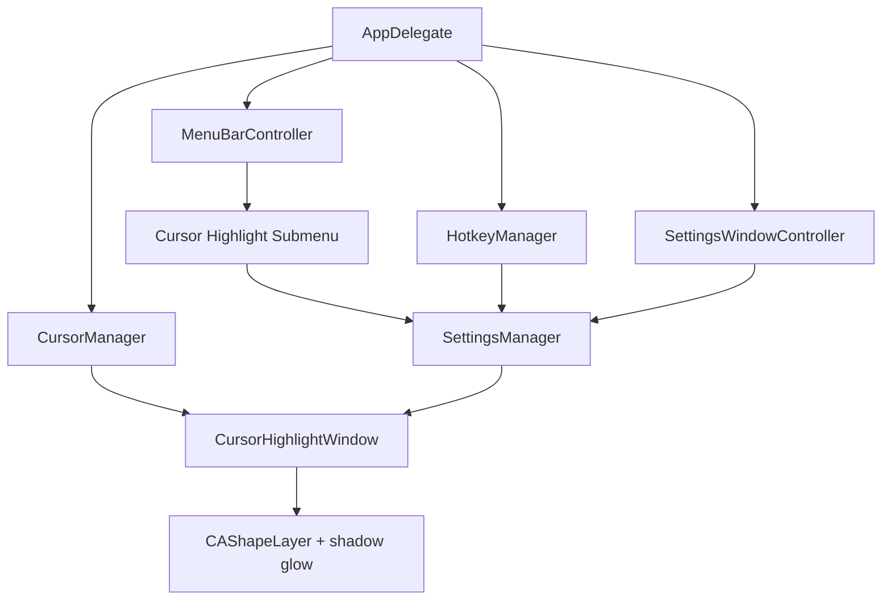

# Design Document: Cursor Highlight Enhancements

## Overview

This design extends Spotdraw's cursor highlight feature with a configurable glow/bloom effect, an expanded size range (20–200pt), a menu bar submenu for quick mid-presentation adjustments, a keyboard shortcut for cycling sizes, and settings window integration for the new glow controls. The implementation builds on the existing `CursorHighlightWindow`, `SettingsManager`, `MenuBarController`, and `HotkeyManager` components.

The glow is achieved using Core Animation's built-in shadow rendering on the existing `CAShapeLayer`, avoiding custom gaussian blur shaders. Window sizing is made dynamic so the frame always accommodates the highlight circle plus the glow bleed. All setting changes propagate immediately to the active highlight window through an `updateAppearance()` method.

## Architecture

The enhancement touches four existing components and introduces no new top-level classes:



**Key architectural decisions:**

1. **No separate glow layer** — Using `CALayer.shadow*` properties on the existing highlight `CAShapeLayer` means the glow follows the shape path automatically without needing a second layer to manage.

2. **Push-based updates** — `CursorHighlightWindow` exposes `updateAppearance()` which re-reads all settings and recalculates layers/frame. Callers (menu actions, settings changes, hotkey) invoke this after mutating `SettingsManager`.

3. **Size presets as a static array** — The four size presets (30, 50, 100, 150) are defined as a constant array. The cycle shortcut increments an index wrapping around. The current index is derived from `SettingsManager.highlightSize` at runtime rather than persisted separately.

## Components and Interfaces

### SettingsManager Extensions

```swift
// New keys and properties added to SettingsManager
private enum Keys {
    // ... existing keys ...
    static let glowEnabled = "glowEnabled"
    static let glowRadius = "glowRadius"
}

var glowEnabled: Bool {
    get { UserDefaults.standard.bool(forKey: Keys.glowEnabled) }
    set { UserDefaults.standard.set(newValue, forKey: Keys.glowEnabled) }
}

var glowRadius: CGFloat {
    get {
        let val = CGFloat(UserDefaults.standard.float(forKey: Keys.glowRadius))
        return val > 0 ? val.clamped(to: 5...50) : 15.0
    }
    set { UserDefaults.standard.set(Float(newValue), forKey: Keys.glowRadius) }
}
```

The `highlightSize` property's range extends from the current 20–100 to 20–200. The `registerDefaults` method adds `glowEnabled: true` and `glowRadius: 15.0`.

### CursorHighlightWindow Changes

```swift
@MainActor internal final class CursorHighlightWindow {
    private var window: NSWindow?
    private var highlightLayer: CAShapeLayer?
    private let settings = SettingsManager.shared

    // New: Public method to refresh appearance from current settings
    func updateAppearance() {
        guard let window, let contentView = window.contentView else { return }

        let totalSize = (settings.highlightSize + (settings.glowEnabled ? settings.glowRadius : 0)) * 2
        let highlightDiameter = settings.highlightSize * 2

        // Resize window
        let currentCenter = NSPoint(
            x: window.frame.midX,
            y: window.frame.midY
        )
        let newFrame = NSRect(
            x: currentCenter.x - totalSize / 2,
            y: currentCenter.y - totalSize / 2,
            width: totalSize,
            height: totalSize
        )
        window.setFrame(newFrame, display: false)
        contentView.frame = NSRect(x: 0, y: 0, width: totalSize, height: totalSize)

        // Update highlight layer
        let offset = (totalSize - highlightDiameter) / 2
        let circleRect = CGRect(x: offset, y: offset, width: highlightDiameter, height: highlightDiameter)
        highlightLayer?.path = CGPath(ellipseIn: circleRect, transform: nil)
        highlightLayer?.fillColor = settings.highlightColor
            .withAlphaComponent(settings.highlightOpacity).cgColor
        highlightLayer?.strokeColor = settings.highlightColor.cgColor

        // Glow via shadow
        if settings.glowEnabled {
            highlightLayer?.shadowColor = settings.highlightColor.cgColor
            highlightLayer?.shadowRadius = settings.glowRadius
            highlightLayer?.shadowOpacity = 0.8
            highlightLayer?.shadowOffset = .zero
        } else {
            highlightLayer?.shadowOpacity = 0
        }
    }
}
```

The `setupWindow()` method is updated to compute initial size as `(highlightSize + glowRadius) * 2` and configure the shadow properties at creation time.

### MenuBarController — Cursor Highlight Submenu

A new submenu is added to the status menu between the existing "Toggle Cursor Highlight" item and the separator. Structure:

```
Cursor Highlight >
  ── Color ──
  ✓ Yellow
    Red
    Blue
    Green
    White
  ──────────
  ── Size ──
    Small (30pt)
  ✓ Medium (50pt)
    Large (100pt)
    Extra Large (150pt)
  ──────────
  ✓ Glow
```

Interface additions to `MenuBarController`:

```swift
// Callback for live-updating the highlight window after menu changes
var onCursorSettingsChanged: (() -> Void)?

// Internal state for checkmarks
private var cursorColorItems: [NSMenuItem] = []
private var cursorSizeItems: [NSMenuItem] = []
private var cursorGlowItem: NSMenuItem!
```

When any submenu item is selected:
1. Update `SettingsManager` property
2. Update checkmark state
3. Invoke `onCursorSettingsChanged?()` which triggers `CursorHighlightWindow.updateAppearance()`

### HotkeyManager — Size Cycle Shortcut

```swift
internal enum GlobalShortcut {
    // ... existing cases ...
    case cycleCursorSize  // Ctrl+Shift+S

    var keyCode: UInt16 {
        switch self {
        // ... existing ...
        case .cycleCursorSize: 1  // S key
        }
    }

    var modifiers: NSEvent.ModifierFlags {
        switch self {
        case .cycleCursorSize: [.control, .shift]
        default: .control
        }
    }

    var cgEventFlags: CGEventFlags {
        switch self {
        case .cycleCursorSize: [.maskControl, .maskShift]
        default: .maskControl
        }
    }
}
```

The size presets array and cycling logic live in `AppDelegate` (or a small helper):

```swift
private let sizePresets: [CGFloat] = [30, 50, 100, 150]

private func cycleCursorSize() {
    let current = settingsManager.highlightSize
    let nextIndex = (sizePresets.firstIndex(of: current).map { $0 + 1 } ?? 0) % sizePresets.count
    settingsManager.highlightSize = sizePresets[nextIndex]
    if cursorManager.isHighlightActive {
        cursorManager.updateHighlightAppearance()
    }
}
```

If the current size doesn't exactly match a preset (e.g., user dragged the slider to 75pt), the shortcut snaps to the next preset greater than the current value, wrapping at the end.

### CursorManager — Appearance Forwarding

```swift
/// Tells the active highlight window to refresh its appearance from settings.
func updateHighlightAppearance() {
    highlightWindow?.updateAppearance()
}
```

### Settings Window — Cursor Tab Additions

The `CursorSettingsTab` gains:
- A "Glow Effect" toggle bound to `glowEnabled`
- A "Glow Radius" slider (5–50pt, step 1) bound to `glowRadius`
- The highlight size slider range updated from `20...100` to `20...200`

## Data Models

### Settings Properties Summary

| Property | Type | Range | Default | UserDefaults Key | Persisted |
|----------|------|-------|---------|-----------------|-----------|
| `glowEnabled` | `Bool` | — | `true` | `"glowEnabled"` | Yes |
| `glowRadius` | `CGFloat` | 5–50 | 15.0 | `"glowRadius"` | Yes |
| `highlightSize` | `CGFloat` | 20–200 | 40.0 | `"highlightSize"` | Yes (existing) |
| `highlightColor` | `NSColor` | — | `.systemYellow` | `"highlightColor"` | Yes (existing) |
| `highlightOpacity` | `CGFloat` | 0.1–1.0 | 0.4 | `"highlightOpacity"` | Yes (existing) |

### Size Presets

```swift
static let cursorSizePresets: [(label: String, size: CGFloat)] = [
    ("Small (30pt)", 30),
    ("Medium (50pt)", 50),
    ("Large (100pt)", 100),
    ("Extra Large (150pt)", 150)
]
```

### Color Presets (reused from ColorPresets.cursor)

```swift
static let cursor: [(name: String, color: NSColor)] = [
    ("Yellow", .systemYellow),
    ("Red", .systemRed),
    ("Blue", .systemBlue),
    ("Green", .systemGreen),
    ("White", .white)
]
```

## Correctness Properties

*A property is a characteristic or behavior that should hold true across all valid executions of a system — essentially, a formal statement about what the system should do. Properties serve as the bridge between human-readable specifications and machine-verifiable correctness guarantees.*

### Property 1: Window frame accommodates highlight plus glow

*For any* valid combination of `highlightSize` in [20, 200] and `glowRadius` in [5, 50] with glow enabled, the highlight window's frame width and height SHALL equal `(highlightSize + glowRadius) * 2`. When glow is disabled, the frame SHALL equal `highlightSize * 2`.

**Validates: Requirements 1.1, 2.2, 2.3**

### Property 2: Glow disabled produces zero shadow

*For any* settings state where `glowEnabled` is `false` and *for any* `glowRadius` value in [5, 50], after calling `updateAppearance()` the highlight layer's `shadowOpacity` SHALL be 0.

**Validates: Requirements 1.6**

### Property 3: Glow color matches highlight color

*For any* valid `highlightColor` and *for any* `glowRadius` in [5, 50] with `glowEnabled` set to `true`, after calling `updateAppearance()` the highlight layer's `shadowColor` SHALL equal the `highlightColor`'s CGColor representation.

**Validates: Requirements 1.2, 3.3**

### Property 4: Size cycle wraps correctly

*For any* starting index `i` in the size presets sequence [30, 50, 100, 150], activating the size cycle function SHALL set `highlightSize` to the preset at index `(i + 1) % 4`. When the current size does not exactly match a preset, the cycle SHALL advance to the smallest preset greater than the current size (wrapping to index 0 if current exceeds all presets).

**Validates: Requirements 4.1, 4.2, 4.3**

### Property 5: Settings persistence round-trip and clamping

*For any* boolean value written to `glowEnabled`, reading it back SHALL return the same value. *For any* CGFloat value written to `glowRadius`, reading it back SHALL return the value clamped to [5, 50]. *For any* CGFloat value written to `highlightSize`, reading it back SHALL return the value clamped to [20, 200]. Values within the valid range SHALL round-trip without modification.

**Validates: Requirements 1.5, 2.1, 2.4, 5.1, 5.2, 5.5**

### Property 6: Submenu checkmarks reflect exclusive selection

*For any* selection of a color or size preset from the cursor highlight submenu, exactly one item in that preset group SHALL have its state set to `.on`, and all other items in the same group SHALL have state `.off`.

**Validates: Requirements 3.8**

## Error Handling

| Scenario | Handling |
|----------|----------|
| `NSScreen.main` is nil at window creation | Defer window setup; retry on next `show()` call when a screen becomes available. |
| `glowRadius` stored as 0 or negative (corrupted defaults) | `SettingsManager` getter clamps to 5–50 range, falling back to 15.0 if ≤ 0. |
| `highlightSize` stored out of range | `SettingsManager` getter clamps to 20–200 range. |
| CGEvent tap not available (no Accessibility) | Size cycle shortcut silently fails; existing behavior. User is prompted for Accessibility at launch. |
| Shadow rendering on low-end GPU | CALayer shadows are hardware-accelerated on all supported macOS versions (13+). No fallback needed. |
| User sets glow radius larger than highlight size | Valid — the glow radiates outward from the circle edge. Window sizing formula handles this correctly. |

## Testing Strategy

### Unit Tests

- **SettingsManager defaults**: Verify `glowEnabled` defaults to `true`, `glowRadius` defaults to 15.0.
- **SettingsManager clamping**: Verify `highlightSize` clamps to [20, 200], `glowRadius` clamps to [5, 50].
- **Size preset cycling**: Verify the cycling logic advances correctly through presets and wraps.
- **Non-preset size snapping**: Verify that when `highlightSize` is not exactly a preset value, the cycle shortcut picks the correct next preset.

### Property-Based Tests

Property-based testing is appropriate for this feature because the settings logic involves pure functions with clear input/output behavior over continuous numeric ranges, and the sizing/clamping logic has universal properties that hold across all valid inputs.

- **Library**: [swift-testing](https://github.com/apple/swift-testing) with custom lightweight generator helpers (random values in specified ranges, random color generation)
- **Minimum iterations**: 100 per property
- **Tag format**: `Feature: cursor-highlight-enhancements, Property {N}: {description}`

Properties to implement as PBT:
1. **Window frame sizing** (Property 1) — generate random `highlightSize` in [20, 200] and `glowRadius` in [5, 50], verify frame formula
2. **Glow disabled zeroes shadow** (Property 2) — generate random `glowRadius` values with `glowEnabled = false`, verify shadowOpacity == 0
3. **Glow color match** (Property 3) — generate random colors, verify shadowColor == highlightColor
4. **Size cycle wrap** (Property 4) — generate random starting indices 0..3, verify advancement and wrapping
5. **Settings round-trip and clamping** (Property 5) — generate random booleans and floats (both in-range and out-of-range), verify round-trip and clamping
6. **Submenu exclusive checkmark** (Property 6) — generate random selections within preset groups, verify exactly one .on state

### Integration Tests

- Toggle cursor highlight on → verify window appears and follows mouse position.
- Change color from menu → verify highlight layer updates visually.
- Activate glow toggle from menu → verify shadow appears/disappears.
- Ctrl+Shift+S cycles through sizes while highlight is active.
- Settings window glow slider → highlight updates in real time.

### Manual Testing

- Visual quality of glow on different display resolutions (Retina vs non-Retina).
- Performance with large highlight size (200pt) + max glow radius (50pt) during rapid mouse movement.
- Verify no clipping at screen edges when highlight window is near display boundaries.
