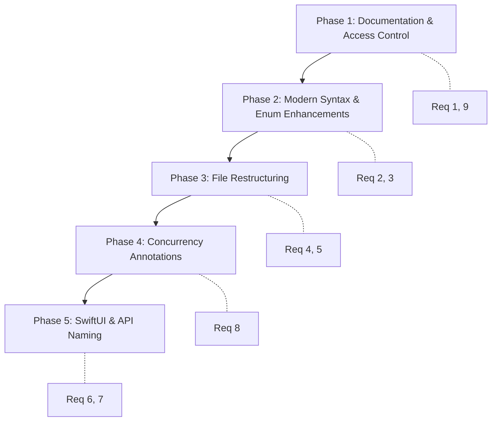

# Design Document: Swift Code Review Refactoring

## Overview

This design specifies a phased refactoring of the SpotDraw macOS annotation application to align with Swift best practices, Apple's API Design Guidelines, modern Swift 5.7+ syntax, and preparation for Swift 6 strict concurrency. The refactoring is non-functional — no user-facing behavior changes — applied across ~12 source files totaling approximately 1,800 lines of code.

The project uses swift-tools-version 6.0 with `.swiftLanguageMode(.v5)` and targets macOS 13 as the minimum deployment platform. These constraints inform several design decisions, particularly around SwiftUI `.onChange` migration and `@MainActor` annotations.

### Design Goals

1. **Zero behavioral regression** — existing property tests must pass after every phase
2. **Incremental commits** — each phase produces a compilable, testable state
3. **Minimal risk ordering** — documentation and additive annotations first, structural changes last
4. **Forward compatibility** — prepare for eventual Swift language mode v6 migration

## Architecture

The refactoring is organized into 5 sequential phases, ordered by increasing risk of introducing compilation errors or behavioral changes:



**Rationale for ordering:**
- Phase 1 (additive-only: `final`, `private`, `///` comments) cannot break compilation
- Phase 2 (enum computed properties, shorthand syntax) is localized per-file
- Phase 3 (file splits, type moves) changes import structure — most likely to cause build issues
- Phase 4 (`@MainActor`, `Sendable`) may trigger warnings that need resolution
- Phase 5 (SwiftUI API, renames) has the most callsite churn and requires `#available` guards

## Components and Interfaces

### Phase 1: Documentation & Access Control (Requirements 1, 9)

**Files Modified:** All 12 source files

#### Access Control Changes

| Type | Change |
|------|--------|
| All classes (16 types) | Add `final` keyword |
| All type declarations | Add explicit `internal` keyword |
| OverlayView internal state (`currentPoints`, `shapeStartPoint`, etc.) | Add `private` |
| CursorHighlightWindow (`window`, `highlightLayer`) | Add `private` |
| SpotlightWindow (`window`, `spotlightView`) | Add `private` |
| HotkeyManager (`handlers`, `globalMonitor`, `localMonitor`) | Add `private` |
| OverlayView.drawingState | Change to `private(set) var` |

#### Documentation Additions

- File-level `///` comments on every `.swift` file describing purpose
- Protocol documentation on `DrawingItem` and all requirements
- Public/internal API documentation on all exposed methods
- Inline algorithm comments on: point smoothing, hit-test geometry, screen coordinate conversion
- Design-decision comment on `DrawingState` being a reference type

### Phase 2: Modern Syntax & Enum Enhancements (Requirements 2, 3)

**Files Modified:** DrawingState.swift, OverlayView.swift, OverlayWindowController.swift, HotkeyManager.swift

#### Swift 5.7 Optional Binding

Replace `guard let x = x` with `guard let x` in:
- `SpotlightWindow.updatePosition(to:)` — already uses shorthand ✓
- `CursorHighlightWindow.updatePosition(to:)` — already uses shorthand ✓
- `ZoomWindow.captureScreen()` — `guard let screen = NSScreen.main` (not same-name, no change needed)

These are already using shorthand syntax in the current code. Verify no other patterns exist.

#### Force Unwrap Elimination

```swift
// Before (DrawingState.swift, FreehandStroke.draw)
path.addLine(to: points.last!)

// After
guard let lastPoint = points.last else { return }
path.addLine(to: lastPoint)
```

Same for `smoothPoints` in OverlayView:
```swift
// Before
smoothed.append(points.last!)

// After
if let lastPoint = points.last {
    smoothed.append(lastPoint)
}
```

#### Enum Enhancements

**ToolType additions:**

```swift
enum ToolType: CaseIterable, Hashable {
    case pen, arrow, rectangle, circle, line, highlighter, eraser

    /// The keyboard shortcut character that activates this tool.
    var keyCharacter: String {
        switch self {
        case .pen: return "p"
        case .arrow: return "a"
        case .rectangle: return "r"
        case .circle: return "o"
        case .line: return "l"
        case .highlighter: return "h"
        case .eraser: return "e"
        }
    }
}
```

**BoardMode.next computed property:**

```swift
enum BoardMode: Equatable {
    case none, white, black, custom(NSColor)

    /// Returns the next mode in the cycling sequence: none → white → black → none.
    /// Custom mode resets to none.
    var next: BoardMode {
        switch self {
        case .none: return .white
        case .white: return .black
        case .black: return .none
        case .custom: return .none
        }
    }
}
```

This eliminates duplicate switch statements in `OverlayView.toggleBoard()` and `OverlayWindowController.toggleBoard()`:

```swift
// Before (duplicated in two files)
switch drawingState.boardMode {
case .none: drawingState.boardMode = .white
case .white: drawingState.boardMode = .black
case .black: drawingState.boardMode = .none
case .custom: drawingState.boardMode = .none
}

// After (both call sites)
drawingState.boardMode = drawingState.boardMode.next
```

#### DrawingItem `any` Syntax

Replace `[any DrawingItem]` usage — already present in the current code. Verify consistency:
```swift
// DrawingState.swift — already correct
var items: [any DrawingItem] = []
private var undoStack: [any DrawingItem] = []
```

#### Default hitTest via Protocol Extension

```swift
extension DrawingItem {
    /// Default hit-test for line-segment shapes.
    /// Only applicable to types with `start` and `end` points.
    func lineSegmentHitTest(point: CGPoint, start: CGPoint, end: CGPoint, threshold: CGFloat) -> Bool {
        return GeometryUtils.distance(from: point, toLineSegmentFrom: start, to: end) <= threshold + lineWidth / 2
    }
}
```

ArrowShape and LineShape delegate to this shared implementation.

### Phase 3: File Restructuring (Requirements 4, 5)

**New Files Created:**
- `Spotdraw/Core/DrawingItems.swift`
- `Spotdraw/Core/GeometryUtils.swift`
- `Spotdraw/Overlay/DrawingRenderer.swift`

**Files Modified:**
- `Spotdraw/Core/DrawingState.swift` (types extracted out)
- `Spotdraw/Overlay/OverlayView.swift` (renderer extracted)

#### File Layout After Restructuring

```
Spotdraw/
├── App/
│   └── AppDelegate.swift
├── Core/
│   ├── AccessibilityManager.swift
│   ├── DrawingItems.swift          ← NEW: FreehandStroke, ArrowShape, RectangleShape, CircleShape, LineShape
│   ├── DrawingState.swift          ← REDUCED: DrawingState class, ToolType, BoardMode, DrawingItem protocol
│   ├── GeometryUtils.swift         ← NEW: GeometryUtils enum (caseless namespace)
│   ├── HotkeyManager.swift
│   └── SettingsManager.swift
├── Cursor/
│   ├── CursorHighlightWindow.swift
│   └── CursorManager.swift
├── MenuBar/
│   └── MenuBarController.swift
├── Overlay/
│   ├── DrawingRenderer.swift       ← NEW: Extracted rendering methods
│   ├── OverlayView.swift           ← REDUCED: Event handling + view lifecycle only
│   └── OverlayWindowController.swift
├── Settings/
│   └── SettingsWindowController.swift
├── Spotlight/
│   └── SpotlightWindow.swift
└── Zoom/
    └── ZoomWindow.swift
```

#### DrawingItems.swift Content

Contains the 5 concrete `DrawingItem` types:
- `final class FreehandStroke: DrawingItem`
- `final class ArrowShape: DrawingItem`
- `final class RectangleShape: DrawingItem`
- `final class CircleShape: DrawingItem`
- `final class LineShape: DrawingItem`

#### GeometryUtils.swift Content

```swift
/// Caseless enum used as a namespace for geometry calculations.
enum GeometryUtils {
    /// Calculates the shortest distance from a point to a line segment.
    ///
    /// Uses vector projection: projects `point` onto the infinite line through
    /// `segmentStart` and `segmentEnd`, clamps the parameter t to [0, 1],
    /// then returns the Euclidean distance to the clamped projection.
    static func distance(from point: CGPoint, toLineSegmentFrom segmentStart: CGPoint, to segmentEnd: CGPoint) -> CGFloat {
        // ... (existing distanceFromPointToLine implementation)
    }
}
```

#### DrawingRenderer.swift Content

Extracted from OverlayView — a struct or enum namespace containing static rendering functions:

```swift
/// Handles all Core Graphics rendering for drawing items and in-progress shapes.
internal struct DrawingRenderer {
    static func drawStroke(points: [CGPoint], color: NSColor, lineWidth: CGFloat, alpha: CGFloat, in context: CGContext) { ... }
    static func drawArrow(from start: CGPoint, to end: CGPoint, color: NSColor, lineWidth: CGFloat, in context: CGContext) { ... }
    static func drawRectangle(_ rect: CGRect, color: NSColor, lineWidth: CGFloat, in context: CGContext) { ... }
    static func drawCircle(in rect: CGRect, color: NSColor, lineWidth: CGFloat, in context: CGContext) { ... }
    static func drawLine(from start: CGPoint, to end: CGPoint, color: NSColor, lineWidth: CGFloat, in context: CGContext) { ... }
    static func drawArrowhead(from start: CGPoint, to end: CGPoint, color: NSColor, lineWidth: CGFloat, in context: CGContext) { ... }
    static func smoothPoints(_ points: [CGPoint]) -> [CGPoint] { ... }
    static func constrainToAngles(from start: CGPoint, to end: CGPoint) -> CGPoint { ... }
    static func rectFrom(start: CGPoint, end: CGPoint) -> CGRect { ... }
}
```

OverlayView retains: event handling (`mouseDown`, `mouseDragged`, `mouseUp`, `keyDown`), view lifecycle, and fade timer management. It delegates rendering to `DrawingRenderer`.

#### Memory Management Improvements (Requirement 5)

**OverlayView — fade timer cleanup on window removal:**

```swift
override func viewDidMoveToWindow() {
    super.viewDidMoveToWindow()
    if window == nil {
        fadeTimer?.invalidate()
        fadeTimer = nil
    } else if fadeTimer == nil {
        startFadeTimer()
    }
}
```

**OverlayWindowController — window cleanup in deinit:**

```swift
deinit {
    if let observer = screenObserver {
        NotificationCenter.default.removeObserver(observer)
    }
    overlayWindows.forEach { $0.close() }
    overlayWindows.removeAll()
}
```

**Type aliases for opaque monitor tokens:**

```swift
// In HotkeyManager
private typealias EventMonitorToken = Any

// In CursorManager
private typealias EventMonitorToken = Any
```

#### HotkeyManager Handler Typealias

```swift
private typealias ShortcutHandler = () -> Void
private var handlers: [GlobalShortcut: ShortcutHandler] = [:]
```

#### Consistent MARK Structure

All files will follow:
```swift
// MARK: - Properties
// MARK: - Init
// MARK: - Setup (if applicable)
// MARK: - Public API
// MARK: - Private Methods
// MARK: - Cleanup
```

### Phase 4: Concurrency Annotations (Requirement 8)

**Strategy:** Since the project uses `.swiftLanguageMode(.v5)`, `@MainActor` annotations are additive and produce no errors — they'll take effect when the project eventually migrates to Swift 6 language mode. No `async/await` restructuring is needed.

#### @MainActor Annotations

Applied to all UI classes:
```swift
@MainActor final class AppDelegate: NSObject, NSApplicationDelegate { ... }
@MainActor final class OverlayWindowController { ... }
@MainActor final class OverlayView: NSView { ... }
@MainActor final class CursorManager { ... }
@MainActor final class CursorHighlightWindow { ... }
@MainActor final class SpotlightWindow { ... }
@MainActor final class ZoomWindow { ... }
@MainActor final class MenuBarController { ... }
@MainActor final class SettingsWindowController { ... }
@MainActor final class HotkeyManager { ... }
```

#### SettingsManager Concurrency Safety

```swift
@MainActor
final class SettingsManager {
    // nonisolated(unsafe) allows the static property to be referenced
    // from non-isolated contexts without triggering a concurrency warning,
    // since all actual access occurs on the main thread.
    nonisolated(unsafe) static let shared = SettingsManager()
    // ...
}
```

#### Sendable Enums

```swift
enum ToolType: CaseIterable, Hashable, Sendable { ... }

enum BoardMode: Equatable, Sendable {
    case none, white, black, custom(NSColor)
}
```

**Note:** `BoardMode` with `custom(NSColor)` cannot conform to `Sendable` because `NSColor` is not `Sendable`. Two options:
1. Add `@unchecked Sendable` conformance (acceptable since the enum is immutable once created)
2. Replace `custom(NSColor)` with `custom(r: CGFloat, g: CGFloat, b: CGFloat, a: CGFloat)` to make it value-type safe

**Decision:** Use `@unchecked Sendable` since this is preparatory and `BoardMode` instances are created and used exclusively on the main thread.

```swift
extension BoardMode: @unchecked Sendable {}
```

#### Timer and Monitor Callbacks

Timer callbacks and NSEvent monitor closures already execute on the main thread (scheduled via `Timer.scheduledTimer` on the main run loop, and `NSEvent.addGlobalMonitorForEvents` dispatches to the main thread). The `@MainActor` class annotations ensure the compiler verifies this at the Swift 6 level.

### Phase 5: SwiftUI & API Naming (Requirements 6, 7)

#### SwiftUI .onChange Migration

**Constraint:** macOS 13 is the minimum target. The new `.onChange(of:) { oldValue, newValue in }` form requires macOS 14.

**Strategy:** Use `#available` to conditionally use the modern API while maintaining backward compatibility:

```swift
// Wrapper extension for cross-version support
extension View {
    @ViewBuilder
    func onChangeCompat<V: Equatable>(of value: V, perform action: @escaping (V) -> Void) -> some View {
        if #available(macOS 14.0, *) {
            self.onChange(of: value) { _, newValue in
                action(newValue)
            }
        } else {
            self.onChange(of: value) { newValue in
                action(newValue)
            }
        }
    }
}
```

All settings tabs migrate from:
```swift
.onChange(of: fadeDuration) { newValue in
    SettingsManager.shared.fadeDuration = newValue
}
```
To:
```swift
.onChangeCompat(of: fadeDuration) { newValue in
    SettingsManager.shared.fadeDuration = newValue
}
```

This eliminates deprecation warnings on macOS 14+ builds while maintaining macOS 13 support.

#### Shared Color Presets

Extract duplicated color arrays into a shared constant:

```swift
/// Shared color preset definitions used across annotation and cursor settings.
enum ColorPresets {
    static let annotation: [(name: String, color: NSColor)] = [
        ("Red", .systemRed),
        ("Blue", .systemBlue),
        ("Green", .systemGreen),
        ("Yellow", .systemYellow),
        ("White", .white)
    ]

    static let cursor: [(name: String, color: NSColor)] = [
        ("Yellow", .systemYellow),
        ("Red", .systemRed),
        ("Blue", .systemBlue),
        ("Green", .systemGreen),
        ("White", .white)
    ]
}
```

#### Slider Range Documentation

```swift
// Stroke width: 1...20 points
// Rationale: 1pt minimum for fine detail, 20pt max avoids obscuring content
Slider(value: $strokeWidth, in: 1...20, step: 1)

// Highlight size: 20...100 points (radius)
// Rationale: 20pt minimum for visibility, 100pt max keeps highlight proportional to cursor
Slider(value: $highlightSize, in: 20...100, step: 5)

// Spotlight size: 50...300 points (diameter)
// Rationale: 50pt minimum for usable spotlight area, 300pt accommodates large UI elements
Slider(value: $spotlightSize, in: 50...300, step: 10)

// Dim intensity: 0.3...0.9 (alpha)
// Rationale: Below 0.3 is imperceptible, above 0.9 hides content entirely
Slider(value: $dimIntensity, in: 0.3...0.9, step: 0.05)

// Opacity: 0.1...1.0 (alpha)
// Rationale: 0.1 minimum ensures cursor highlight remains visible
Slider(value: $highlightOpacity, in: 0.1...1.0, step: 0.05)

// Fade duration: 1...10 seconds
// Rationale: 1s minimum for visual feedback, 10s max before annotations become stale
Slider(value: $fadeDuration, in: 1...10, step: 0.5)
```

#### API Naming Changes

| Current | Renamed | Rationale |
|---------|---------|-----------|
| `distanceFromPointToLine(point:lineStart:lineEnd:)` | `GeometryUtils.distance(from:toLineSegmentFrom:to:)` | Swift naming: preposition describes relationship |
| `createOverlayWindow(for:)` | `makeOverlayWindow(for:)` | Apple convention: `make` for factory methods |
| `handleMouseEvent(_:)` in CursorManager | `routeMouseEvent(_:)` | Better describes dispatching behavior |

**No-change confirmations:**
- `onDeactivate`, `onToggleAnnotation` — already follow `on` + event pattern ✓
- `isHighlightActive`, `isSpotlightActive`, `isZoomActive`, `isActive`, `isDrawing`, `isShiftHeld` — all read as assertions ✓

#### GlobalShortcut Switch Expressions (Swift 5.9)

```swift
// Before
var keyCode: UInt16 {
    switch self {
    case .toggleAnnotation: return 2
    case .toggleCursorHighlight: return 1
    case .toggleSpotlight: return 37
    case .toggleZoom: return 6
    }
}

// After (Swift 5.9 switch expression)
var keyCode: UInt16 {
    switch self {
    case .toggleAnnotation: 2
    case .toggleCursorHighlight: 1
    case .toggleSpotlight: 37
    case .toggleZoom: 6
    }
}
```

## Data Models

No new data models are introduced. The existing models are restructured:

### DrawingState.swift (After Restructuring)

```
┌─────────────────────────────────────────┐
│ DrawingState.swift                       │
├─────────────────────────────────────────┤
│ - DrawingItem protocol                  │
│ - ToolType enum (+ CaseIterable,        │
│   Hashable, Sendable, keyCharacter)     │
│ - BoardMode enum (+ next, Sendable)     │
│ - DrawingState class                    │
│   - items: [any DrawingItem]            │
│   - undoStack: [any DrawingItem]        │
│   - activeTool, activeColor, etc.       │
│   - addItem, undo, redo, clearAll       │
└─────────────────────────────────────────┘
```

### DrawingItems.swift (New)

```
┌─────────────────────────────────────────┐
│ DrawingItems.swift                      │
├─────────────────────────────────────────┤
│ - FreehandStroke: DrawingItem           │
│ - ArrowShape: DrawingItem              │
│ - RectangleShape: DrawingItem          │
│ - CircleShape: DrawingItem             │
│ - LineShape: DrawingItem               │
└─────────────────────────────────────────┘
```

### GeometryUtils.swift (New)

```
┌─────────────────────────────────────────┐
│ GeometryUtils.swift                     │
├─────────────────────────────────────────┤
│ - enum GeometryUtils (caseless)         │
│   - distance(from:toLineSegmentFrom:to:)│
│ - DrawingItem extension                 │
│   - lineSegmentHitTest(...)             │
└─────────────────────────────────────────┘
```

## Error Handling

This refactoring does not introduce new error-handling paths. Key considerations:

1. **Force unwrap elimination** — `points.last!` replaced with `guard let` early returns. This changes behavior only for the empty-points edge case (which should never occur in practice since strokes require ≥2 points).

2. **Build failures during restructuring** — Phase 3 file splits may temporarily break compilation if types reference each other across files. Within a single Swift module (SPM target), all types are visible without explicit imports, so file splits should compile cleanly. The test suite runs after each phase to confirm.

3. **`@MainActor` isolation warnings** — In Swift language mode v5, these are silenced. When the project eventually migrates to v6, the annotations will surface any threading issues as compile errors, which is the desired outcome.

4. **SwiftUI `#available` fallback** — The `onChangeCompat` wrapper ensures no runtime crash on macOS 13 while using the modern API on macOS 14+.

## Testing Strategy

### Approach

This is a pure refactoring — no new features or behavioral changes. The testing strategy focuses on **regression prevention** rather than new test creation.

### Existing Test Suite

The project has property-based preservation tests in `SpotdrawTests/PreservationPropertyTests.swift` that verify:
- Tool switching (key → activeTool mapping)
- Board mode cycling (none → white → black → none)
- Fade mode toggle behavior
- Undo/redo stack integrity
- Drawing item property preservation
- ClearAll behavior

These tests run 100 iterations each using a deterministic PRNG and cover Requirements 3.1–3.6 from a previous spec.

### Testing Protocol Per Phase

| Phase | Verification |
|-------|-------------|
| Phase 1 (Docs/Access) | `swift build` succeeds, all existing tests pass |
| Phase 2 (Syntax/Enums) | `swift build` succeeds, all existing tests pass, verify `BoardMode.next` produces same cycling |
| Phase 3 (File Restructure) | `swift build` succeeds, all existing tests pass (critical — file moves can break) |
| Phase 4 (Concurrency) | `swift build` succeeds with no new warnings, all existing tests pass |
| Phase 5 (SwiftUI/Names) | `swift build` succeeds, all existing tests pass, manual UI verification of settings tabs |

### Build Command

```bash
swift build --package-path /Users/aaranvi/dev/spotdraw
```

### Test Execution

```bash
swift build --target SpotdrawTests --package-path /Users/aaranvi/dev/spotdraw && .build/debug/SpotdrawTests
```

### Why PBT Is Not Applicable

Property-based testing is not appropriate for this spec because:

1. **No new algorithmic behavior** — The refactoring adds annotations, renames methods, and moves types between files. There are no new input/output transformations to verify.
2. **Existing PBT coverage** — The `PreservationPropertyTests.swift` already validates the behavioral invariants (tool switching, undo/redo, board cycling) that must be preserved.
3. **Changes are structural/declarative** — Access control keywords, documentation comments, `@MainActor` annotations, and file splits do not produce testable input-dependent behavior.
4. **Compilation is the primary check** — Most requirements (e.g., "add `final`", "add `private`") are verified by successful compilation. If the code compiles and existing tests pass, the refactoring is correct.

### Additional Verification

For Phase 5 SwiftUI changes, manual verification is needed:
1. Open Settings window
2. Adjust sliders in each tab
3. Confirm values persist (close and reopen)
4. Confirm no visual regressions

## Backward Compatibility

### macOS 13 Minimum Target

| Change | Minimum macOS Required | Strategy |
|--------|----------------------|----------|
| Swift 5.7 optional shorthand (`guard let x`) | macOS 13 ✓ | Direct use |
| Swift 5.9 switch expressions | macOS 13 ✓ | Direct use (compiler feature, not runtime) |
| `CaseIterable`, `Hashable` | macOS 13 ✓ | Direct use |
| `@MainActor` | macOS 13 ✓ | Direct use (concurrency runtime available since macOS 12) |
| `Sendable` | macOS 13 ✓ | Direct use |
| `nonisolated(unsafe)` | macOS 13 ✓ | Compiler feature (Swift 5.10+/6.0 toolchain) |
| `.onChange(of:) { old, new in }` | **macOS 14** | `#available` wrapper with fallback |
| `@Observable` macro | **macOS 14** | NOT adopted — document `@State` snapshot pattern instead |

### No Version Bump Required

All changes can be implemented within the current macOS 13 minimum target. The SwiftUI `.onChange` migration uses a compatibility wrapper with `#available` to avoid requiring a version bump. The `@Observable` macro (macOS 14+) is explicitly not adopted; instead, the existing `@State` + `SettingsManager.shared` pattern is documented as intentional.
